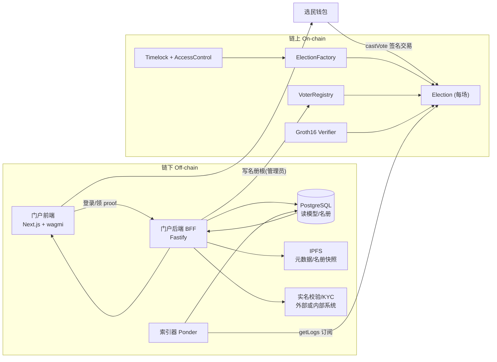
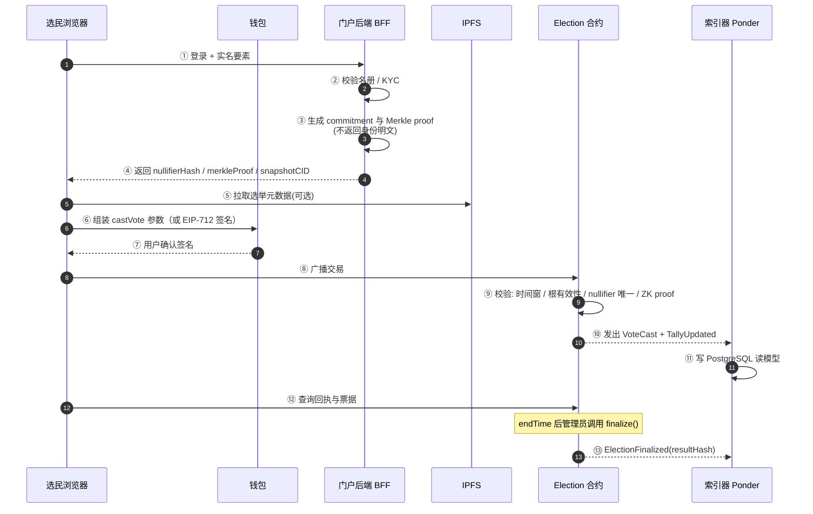

# 基于区块链的去中心化线上投票系统 · 实现文档

| 项 | 内容 |
| --- | --- |
| 项目代号 | `ChainVote`（暂定） |
| 文档版本 | v0.1（初稿） |
| 状态 | 待评审 |
| 目标读者 | 合约工程师、前端工程师、测试/安全工程师、项目负责人 |
| 适用范围 | 企业内部治理、行业协会、社区议事、DAO 治理等**非政治性**投票场景 |

---

## 0. 文档约定

| 标记 | 含义 | 处理方式 |
| --- | --- | --- |
| **【待确认】** | 依赖外部决策、尚未冻结的参数 | 立项会逐条确认，确认后转为硬约束 |
| **【推荐方案】** | 本文给出的默认建议，可直接执行 | 若有异议，走变更流程 |
| **【硬约束】** | 安全/合规红线，不可裁剪 | 任何裁剪需安全负责人书面签字 |
| 数字区间 | 如「约 20k gas」 | 均为量级估算，最终以实测为准 |

命名规范：合约 `PascalCase`，函数/变量 `camelCase`，事件 `PascalCase` 动词过去式，常量 `UPPER_SNAKE_CASE`，链下接口路径 `/api/v1/...`。

---

## 1. 需求分析

### 1.1 角色与权限

| 角色 | 说明 | 链上权限 | 链下权限 |
| --- | --- | --- | --- |
| 选举管理员 | 创建/配置选举、管理名册根 | `ELECTION_ADMIN_ROLE`：`createElection`、`updateVotersRoot`、`finalize` | 后台配置、名册导入 |
| 选民 | 通过身份校验后投票 | 无特权，调用 `castVote` | 登录、领取 Merkle proof |
| 观察员 / 审计者 | 独立复算结果 | 只读（`view` + 事件查询） | 只读报表、导出证据包 |
| 平台运维 | 部署、升级、监控 | `DEFAULT_ADMIN_ROLE`（置于 Timelock 之后） | 运维后台、日志 |
| 公众 | 查看最终结果 | 只读 | 结果页（无需登录） |

权限原则：**最小权限 + 角色分离**。部署者私钥不直接持有业务权限，业务权限交由 `TimelockController` 延时执行。

### 1.2 端到端业务流程

| 阶段 | 输入 | 处理 | 输出 | 链上落脚点 |
| --- | --- | --- | --- | --- |
| S1 选举创建 | 标题、选项、起止时间、名册、规则 | 管理员创建并上链配置 | `electionId` | `ElectionCreated` 事件 + 配置存储 |
| S2 选民身份验证 | 学号/工号/手机号 + 实名要素 | 链下 KYC → 生成身份承诺 `commitment` → 建 Merkle 树 → 上链根 | 选民持有 `nullifierHash` + `merkleProof` | `VoterRegistry` 存 `votersRoot` |
| S3 投票 | `electionId`、`optionIndex`、`nullifierHash`、Merkle proof、ZK proof | 合约校验三件事：名册有效、未投票、凭证真实 | 交易上链，票据可查 | `VoteCast` / `TallyUpdated` 事件 |
| S4 计票 | 已确认票 | 时间窗结束 → `finalize` → 冻结票数与结果哈希 | 最终票数数组 | `ElectionFinalized` 事件 + `resultHash` |
| S5 结果公示 | 链上结果 + 元数据 | 前端展示、导出审计证据包 | 结果页、CSV/JSON 证据包 | 事件重放可完全复算 |

详细时序见 [3.6](#36-一次投票的调用时序)。

### 1.3 功能需求清单

| ID | 需求 | 优先级 | 验收要点 |
| --- | --- | --- | --- |
| FR-01 | 创建选举：标题、描述、N 个选项、起止时间、投票规则 | P0 | 参数越界（如 `endTime <= startTime`）必须回滚 |
| FR-02 | 选举元数据（长文本、图片、章程）存于去中心化存储，链上仅存 CID | P0 | CID 可被 `ipfs cat` 还原 |
| FR-03 | 选民名册导入与 Merkle 根上链 | P0 | 根更新仅允许在 `startTime` 前 |
| FR-04 | 选民身份验证：链下实名校验 + 链上凭证校验 | P0 | 未在名册者无法生成有效 proof |
| FR-05 | 投票：单选 / 多选（可配置），支持改票（可配置） | P0 | 改票须覆盖旧票，净票数不增加 |
| FR-06 | 防重复投票：同一身份在一次选举中最多计 1 票 | P0 | 重复提交被 revert，不产生净增票 |
| FR-07 | 计票：时间窗内实时累计，结束后封存 | P0 | 封存后票数不可再变 |
| FR-08 | 结果公示：公开只读页面 + 事件可复算 | P0 | 第三方仅凭链上数据可复算出同一结果 |
| FR-09 | 个人可验证：选民可查自己的票「已计入」 | P1 | 提供票据查询，不泄露选项 |
| FR-10 | 审计导出：事件日志 → 证据包（含交易哈希、区块号、时间戳） | P1 | 证据包可离线校验 |
| FR-11 | 选举归档与多选举并存 | P1 | 同一合约可承载多场选举，互不干扰 |
| FR-12 | 紧急暂停（仅暂停投票，不暂停查询） | P1 | `Pausable` 仅作用于 `castVote` |

**【待确认】** 是否允许改票、是否允许多选、每场选举选项上限（推荐默认：不可改票、单选、选项 ≤ 16）。

### 1.4 非功能需求

| 类别 | 需求 | 目标值 / 说明 |
| --- | --- | --- |
| 防重复投票 | `nullifierHash` 全局唯一 | **【硬约束】** 使用状态映射或位图，二选一且不可回退 |
| 隐私保护 | 链上不出现「身份 ↔ 选项」的关联 | 公开投票者 **【推荐方案】** 使用 Semaphore / Groth16 匿名凭证；仅隐去身份而不隐去选项的方案须在文档中明示 |
| 可审计性 | 全流程事件化，任何人可独立复算 | 关键状态变更必须发事件；`resultHash = keccak256(abi.encode(electionId, finalCounts, votesRoot))` |
| 不可篡改 | 结果封存后不可修改 | `finalize` 幂等且只可调用一次 |
| 可用性 | 投票峰值并发 | **【待确认】** 目标 QPS / 单场选民规模（推荐按 10 万选民、峰值 500 TPS 设计） |
| 性能 | 单票链上成本 | **【待确认】** 目标 < 0.02 USD / 票（L2 估） |
| 互操作性 | 前端仅依赖标准 EIP-1193 / EIP-712 | 不绑定单一钱包厂商 |
| 合规 | 个人信息与链上数据分离 | 链上只存哈希/CID，不存任何可识别个人身份的信息；名册明文存于受控数据库 |
| 可移植性 | 一套合约可部署到任意 EVM 链 | 不依赖链特有预编译或私有 RPC 扩展 |
| 可观测性 | 投票成功率、失败原因、gas 消耗可监控 | 接入 Tenderly / OZ Defender / 自建指标 |

### 1.5 范围边界与合规约束

1. **【硬约束】不适用于法定选举。** 本系统的定位是组织内部治理与社区议事的技术工具，不用于《中华人民共和国全国人民代表大会和地方各级人民代表大会选举法》所规定的各级人大代表及国家机关领导人员的法定选举，也不替代任何法定选举程序。
2. **【硬约束】投票权凭证不得具金融属性。** 不为投票权发行可转让、可交易的代币或 NFT；`ERC-20`/`ERC-721` 形式的「投票权」在本项目中禁用。
3. 选民实名数据（身份证/学号/手机号）只存于链下受控库，遵循《个人信息保护法》最小必要原则；链上仅存不可逆承诺。
4. **【待确认】** 是否需要数据出境评估（若使用境外 RPC / IPFS Pinning 服务）。

---

## 2. 技术选型

### 2.1 区块链平台对比

| 维度 | Ethereum L1 | Base / Arbitrum / Optimism（L2） | Polygon PoS | Hyperledger Fabric | FISCO BCOS | Solana |
| --- | --- | --- | --- | --- | --- | --- |
| 去中心化程度 | 最高 | 高（继承 L1 安全） | 中 | 低（联盟许可） | 低（联盟许可） | 中高 |
| 单票 gas 成本 | 高 | 低 | 低 | 极低（无 gas） | 极低（无 gas） | 极低 |
| EVM 兼容 | ✅ | ✅ | ✅ | ❌（Go/Java Chaincode） | ⚠️ 部分（Solidity 子集） | ❌（Rust） |
| ZK 验证成本 | 高 | 低（L2 摊薄） | 中 | 不适用 | 不适用 | 中 |
| 审计工具链成熟度 | 最高 | 高 | 高 | 中 | 中 | 中 |
| 公开可验证性 | 最高（任意人可复算） | 高 | 高 | 低（需授权节点） | 低 | 高 |
| 国内合规友好度 | 低 | 低 | 低 | **高** | **高** | 低 |
| 实名可控性 | 无 | 无 | 无 | 有（MSP 身份体系） | 有 | 无 |
| 运维复杂度 | 中 | 中 | 低 | 高 | 高 | 中 |

**取舍逻辑：**

- 若核心诉求是**公众可独立验证**（任何人都能复算结果），必须选公开链 → 取 L2，而非 L1（成本）或联盟链（可验证性受损）。
- 若核心诉求是**实名可控 + 机构内部使用 + 无代币**，联盟链（Fabric / FISCO BCOS）更贴合，代价是牺牲公开可验证性，审计需依赖授权观察节点。

### 2.2 智能合约语言对比

| 语言 | 平台 | 优势 | 劣势 | 本项目适配度 |
| --- | --- | --- | --- | --- |
| **Solidity** | EVM 系 | 生态最大、OpenZeppelin 可复用、审计工具完备、Groth16 verifier 可直接生成 | 语言特性多，易写错 | **最高** |
| Vyper | EVM 系 | 语法精简、可读性高、审计面小 | 生态与库少，ZK verifier 支持弱 | 中 |
| Rust (Anchor) | Solana | 性能好、并发强 | 与 EVM 生态不通用，ZK 验证生态不同 | 低 |
| Go / Java Chaincode | Fabric | 与既有企业栈契合 | 无公开可验证性，社区合约库少 | 中（仅联盟链方案） |
| Move | Sui / Aptos | 资源模型天然防重入 | 生态新，工具链不成熟 | 低 |

### 2.3 选型结论

**主方案（【推荐方案】公开链路线）**

| 层 | 选型 | 理由 |
| --- | --- | --- |
| 链 | EVM 兼容 L2：Sepolia→Base Sepolia（测试）/ Base 或 Arbitrum One（生产） | 继承 L1 安全，gas 低 1–2 个数量级，EVM 工具链全兼容 |
| 合约语言 | Solidity `^0.8.24` | 内置溢出检查、custom errors 省 gas、生态与审计资源最全 |
| 匿名凭证 | Semaphore v4（Groth16 + Poseidon Merkle） | 无需自研 ZK 电路即可实现「证明我在名册内且未投过票」 |
| 合约框架 | Foundry | Solidity 原生测试、`forge fuzz`、`invariant`、部署脚本一体化 |
| 前端 | Next.js 14 + TypeScript + wagmi v2 + viem | 服务端渲染利于结果页 SEO 与首屏；`viem` 类型安全 |
| 钱包 | RainbowKit / ConnectKit（含 WalletConnect v2） | 覆盖主流浏览器钱包与移动端 |
| 元数据存储 | IPFS（Kubo + 商业 Pinning） | 内容寻址、CID 不可变，链上仅存 32 字节 |
| 索引 | Ponder 或 The Graph | 事件 → 数据库，避免前端直连 `getLogs` 被限流 |

**备选方案（【待确认】若强制要求联盟链）**：FISCO BCOS 3.x + Solidity（子集）+ WeBASE 中间件；或 Hyperledger Fabric 2.5 + Go Chaincode。代价：公开可验证性丧失，需额外建设「观察节点公示 + 日志哈希定时锚定到公开链」作为补偿。

**关键取舍记录**

| 取舍点 | 选择 | 放弃的东西 | 补偿措施 |
| --- | --- | --- | --- |
| L2 而非 L1 | 成本 | 部分去中心化程度 | 结果哈希可定期锚定回 L1 |
| 匿名凭证而非实名上链 | 隐私 | 链上强身份绑定 | 链下名册 + 审计接口 + 承诺可验证 |
| 链下名册而非链上白名单 | 成本 | 链上全量可见 | Merkle 根上链，根可审计；名册快照存 IPFS |
| IPFS 而非链上明文 | 成本 | 单点依赖 | 多 Pinning 服务 + 定期校验 CID 可寻址性 |

### 2.4 工具清单

| 类别 | 工具 | 版本（建议） | 用途 |
| --- | --- | --- | --- |
| 包管理 | pnpm | 9.x | 单体仓库依赖管理 |
| 运行时 | Node.js | 22 LTS | 前端与脚本运行时 |
| 合约开发 | Foundry（`forge`/`cast`/`anvil`） | 1.x stable | 编译、测试、本地链、脚本 |
| 合约依赖 | `openzeppelin-contracts` | 5.x | `AccessControl`/`Pausable`/`Timelock`/`MerkleProof` |
| 匿名凭证 | `semaphore-protocol/contracts` + `@semaphore-protocol/group` | v4 | 身份承诺、组、Groth16 验证 |
| 测试（合约） | `forge-std` | latest | Solidity 单测、fuzz、invariant |
| 测试（集成） | Vitest + viem | latest | 前端↔链上端到端 |
| 本地链 | Anvil | 随 Foundry | 确定性测试链（`--fork-url` 支持分叉） |
| 测试网 | Base Sepolia / Polygon Amoy / Arbitrum Sepolia | — | 灰度验证 |
| 水龙头 | 各测试网官方 faucet | — | 领取测试 gas |
| 元数据存储 | IPFS Kubo + Pinata / Filebase | — | 选举元数据、名册快照 |
| 索引 | Ponder（或 The Graph Studio） | latest | 事件索引 → PostgreSQL |
| 数据库 | PostgreSQL | 16 | 链下读模型、名册、审计导出 |
| 后端 | Fastify（或 NestJS） | latest | BFF：登录、名册、proof 签发、报表 |
| 前端 | Next.js + TailwindCSS + shadcn/ui | 14/3.x | 门户 UI |
| 钱包接入 | wagmi v2 + viem + RainbowKit | 2.x | 连接、签名、发交易、订阅回执 |
| 图表 | Recharts / ECharts | latest | 结果可视化 |
| 静态分析 | Slither、Aderyn | latest | CI 内自动扫描 |
| 模糊测试 | Echidna 或 Medusa | latest | 状态机不变量测试 |
| 监控 | Tenderly Alerts / OZ Defender | — | 异常交易、权限变更告警 |
| 验证 | Etherscan / Basescan 多链验证 API | — | 源码公开验证 |
| CI/CD | GitHub Actions | — | lint→test→audit→deploy 流水线 |
| 审计 | 第三方审计 + Immunefi（可选） | — | 上线前强制 |

**【待确认】** 是否已有企业内部的 RPC 供应商、IPFS 服务商与 CI 平台（推荐：Alchemy/Infura + Pinata + 自建 Runner）。

---

## 3. 系统架构

### 3.1 总体架构



### 3.2 链上 / 链下职责划分

| 职责 | 链上 | 链下 | 说明 |
| --- | --- | --- | --- |
| 选举配置 | ✅ 存关键参数（时间、根、选项数） | ✅ 富文本/图片/章程 | 链上只存 CID，降低 gas |
| 选民名册 | ✅ 仅 Merkle 根 | ✅ 明文名册 + KYC 结果 | 隐私与成本双重要求 |
| 身份验证 | ✅ 校验 Merkle proof / ZK proof | ✅ 实名核验、签发 proof | 链上不做实名 |
| 投票记录 | ✅ 事件 + `nullifier` 状态 | ✅ 镜像入库便于查询 | 链为唯一真相源 |
| 计票 | ✅ 公开投票直接累计 / 隐私投票验证明文后累计 | ✅ 异步重算校对 | 链上为准 |
| 结果公示 | ✅ `finalCounts` + `resultHash` | ✅ 可视化、导出 | 链下仅展示 |
| 权限治理 | ✅ `AccessControl` + `Timelock` | ❌ | 私钥不直接持有业务权限 |
| 审计 | ✅ 事件日志 | ✅ 证据包生成 | 证据包必须可离线复算 |

### 3.3 合约模块划分

```
contracts/
├── ElectionFactory.sol      # 创建选举、注册 Election、维护 electionId → address
├── Election.sol             # 单场选举的核心逻辑（投票、计票、封存、查询）
├── VoterRegistry.sol        # 名册 Merkle 根、快照 CID、根变更历史
├── verifier/
│   └── SemaphoreVerifier.sol # Groth16 验证器（生成或复用，勿手写）
├── governance/
│   ├── Roles.sol            # 角色常量：ELECTION_ADMIN_ROLE / AUDITOR_ROLE / PAUSER_ROLE
│   └── Timelock.sol         # OpenZeppelin TimelockController 实例化脚本
└── libs/
    ├── BallotCodec.sol      # 位图/打包编解码（多选与 gas 优化）
    └── Errors.sol           # 统一 custom errors
```

| 模块 | 是否可升级 | **【推荐方案】** |
| --- | --- | --- |
| `Election` | **不可升级** | 选举期间合约不可变，换取「无后台改票」的可信度 |
| `ElectionFactory` | 不可升级（新版本部署新 factory） | 避免代理存储冲突风险 |
| `VoterRegistry` | 不可升级 | 根更新本身即业务行为，无需代理 |
| 前端 / BFF | 常规滚动发布 | 不在信任边界内 |

### 3.4 核心数据结构

```solidity
// SPDX-License-Identifier: MIT
pragma solidity ^0.8.24;

struct ElectionConfig {
    bytes32 metadataCID;      // IPFS CID 的 bytes32 表示（或双槽存完整 CID 字符串）
    bytes32 votersRoot;       // 名册 Merkle 根
    uint64  startTime;        // 投票开始（unix 秒）
    uint64  endTime;          // 投票结束（unix 秒）
    uint8   optionCount;      // 选项数，<= 16
    uint8   maxChoices;       // 每人最多可选数（1 = 单选）
    bool    revotable;        // 是否允许改票
    address verifier;         // Groth16 验证器地址
    bool    finalized;        // 是否已封存
}

struct ElectionStats {
    uint64  totalBallots;     // 有效票总数
    uint64  uniqueVoters;     // 去重后人数（= 被使用的 nullifier 数）
    uint64[] counts;          // 各选项得票数
    bytes32 votesRoot;        // 渐进式 Merkle 根（含所有票据承诺）
    bytes32 resultHash;       // 封存时的结果哈希
}

// 隐私投票：每票以承诺形式入树
struct Ballot {
    bytes32 nullifierHash;    // 防重复：身份承诺的哈希
    bytes32 ballotCommitment; // H(option || salt || nullifierHash)，公开投票时可为 0
    uint8   optionIndex;      // 公开投票时可见；隐私投票时由 ZK proof 约束
}

// 位图：一次选举最多 2^32 个 nullifier 槽位，1 slot = 256 位
mapping(uint256 => uint256) private _nullifierBitmap; // 可选，用于极低成本去重
mapping(address => bool)    public  isOperator;
```

**存储布局取舍**

| 方案 | 去重成本 | 查询能力 | 适用 |
| --- | --- | --- | --- |
| `mapping(bytes32 => bool)` | 首次写约 20k gas | 可直接查单个 | 选民规模 < 5 万，需公开单票状态 |
| 位图 `mapping(uint256 => uint256)` | 首次写 1 槽服务 256 票，均摊约 80 gas | 只能批量读 | **【推荐方案】** 大规模选举 |
| 只存 `votesRoot` 渐进树 | 最低 | 需生成 proof 才能验证 | 隐私投票（Semaphore 默认） |

**【硬约束】** 三种方案只能选一种作为唯一真相源，禁止双写，避免状态不一致。

### 3.5 合约接口与事件

```solidity
// ============ ElectionFactory.sol ============
interface IElectionFactory {
    event ElectionCreated(
        uint256 indexed electionId,
        address indexed election,
        address indexed creator,
        bytes32 metadataCID,
        uint64  startTime,
        uint64  endTime
    );

    function createElection(ElectionConfig calldata cfg)
        external
        onlyRole(ELECTION_ADMIN_ROLE)
        returns (uint256 electionId, address election);

    function electionOf(uint256 electionId) external view returns (address);
    function electionCount() external view returns (uint256);
}

// ============ Election.sol ============
interface IElection {
    // --- 事件 ---
    event VoteCast(
        uint256 indexed electionId,
        bytes32 indexed nullifierHash,
        uint8   indexed optionIndex,
        bytes32 ballotCommitment,
        uint256 leafIndex
    );
    event VoteReplaced(
        uint256 indexed electionId,
        bytes32 indexed nullifierHash,
        uint8   oldOption,
        uint8   newOption
    );
    event TallyUpdated(uint256 indexed electionId, uint64[] counts, bytes32 votesRoot);
    event ElectionFinalized(
        uint256 indexed electionId,
        uint64[] finalCounts,
        uint64  totalBallots,
        bytes32 resultHash,
        uint64  finalizedAt
    );
    event ElectionPaused(uint256 indexed electionId, address indexed by);
    event MetadataUpdated(uint256 indexed electionId, bytes32 newCID);

    // --- 投票 ---
    /// @notice 提交一票；隐私模式下 proof 验证「该 commitment 在名册内且 nullifier 未用」
    /// @param proof Groth16 证明，长度按所选 circuits 固定（Semaphore v4 为 8 个 uint256）
    function castVote(
        uint256 electionId,
        uint8   optionIndex,
        bytes32 nullifierHash,
        bytes32 ballotCommitment,
        uint256[] calldata proof
    ) external;

    /// @notice 改票（仅 cfg.revotable = true 时可调用）
    function changeVote(uint256 electionId, bytes32 nullifierHash, uint8 newOption)
        external;

    // --- 计票与封存 ---
    /// @notice 到达 endTime 后调用一次；幂等保护，重复调用 revert
    function finalize(uint256 electionId) external;

    // --- 查询 ---
    function getConfig(uint256 electionId) external view returns (ElectionConfig memory);
    function getResult(uint256 electionId) external view returns (uint64[] memory counts);
    function isNullifierUsed(uint256 electionId, bytes32 nullifierHash)
        external view returns (bool);
    function verifyBallot(
        uint256 electionId,
        bytes32 nullifierHash,
        bytes32[] calldata merkleProof,
        uint256 leafIndex
    ) external view returns (bool included);

    // --- 管理 ---
    function updateVotersRoot(uint256 electionId, bytes32 newRoot, bytes32 snapshotCID)
        external;
    function setPaused(uint256 electionId, bool paused) external;
}

// ============ VoterRegistry.sol ============
interface IVoterRegistry {
    event VotersRootUpdated(
        uint256 indexed electionId,
        bytes32 newRoot,
        bytes32 snapshotCID,
        uint64  effectiveFrom
    );

    function currentRoot(uint256 electionId) external view returns (bytes32);
    function rootHistory(uint256 electionId) external view returns (bytes32[] memory);
}
```

**关键不变量（用于 fuzz / invariant 测试）**

| 编号 | 不变量 | 断言 |
| --- | --- | --- |
| INV-1 | 票数守恒 | `sum(counts) == totalBallots` |
| INV-2 | 去重成立 | 每个 `nullifierHash` 至多贡献 1 票 |
| INV-3 | 时间窗封闭 | `finalized` 后 `castVote` 必然 revert |
| INV-4 | 封存不可逆 | `finalize` 成功次数 ≤ 1 |
| INV-5 | 根不可逆 | `startTime` 之后 `VoterRegistry` 根不再变化 |

### 3.6 一次投票的调用时序



**失败分支**

| 失败点 | 触发条件 | 合约行为 | 前端提示 |
| --- | --- | --- | --- |
| ⑨ | 不在时间窗 | revert `NotInVotingWindow()` | 「投票未开始 / 已结束」 |
| ⑨ | Merkle proof 不匹配根 | revert `InvalidMerkleProof()` | 「名册校验失败，请联系管理员」 |
| ⑨ | nullifier 已使用 | revert `AlreadyVoted()` | 「您已投过票」 |
| ⑨ | ZK proof 校验失败 | revert `InvalidProof()` | 「凭证无效，请刷新后重试」 |
| ⑨ | 已暂停 | revert `EnforcedPause()` | 「投票已临时暂停」 |
| ⑧ | gas 不足 / 用户拒签 | 交易未上链 | 无副作用，可重试 |

### 3.7 链下数据模型（读模型）

```sql
-- 选举读模型
CREATE TABLE elections (
  election_id      BIGINT PRIMARY KEY,
  contract_address TEXT        NOT NULL,
  title            TEXT        NOT NULL,
  metadata_cid     TEXT        NOT NULL,
  voters_root      BYTEA       NOT NULL,
  start_time       TIMESTAMPTZ NOT NULL,
  end_time         TIMESTAMPTZ NOT NULL,
  option_count     SMALLINT    NOT NULL,
  finalized        BOOLEAN     NOT NULL DEFAULT FALSE,
  result_hash      BYTEA
);

-- 票据索引（不含身份明文）
CREATE TABLE ballots (
  election_id      BIGINT      NOT NULL,
  nullifier_hash   BYTEA       NOT NULL,
  option_index     SMALLINT,
  block_number     BIGINT      NOT NULL,
  tx_hash          BYTEA       NOT NULL,
  log_index        INT         NOT NULL,
  block_time       TIMESTAMPTZ NOT NULL,
  PRIMARY KEY (election_id, nullifier_hash)
);

-- 名册（受控，禁入链上；含访问审计）
CREATE TABLE voter_roster (
  election_id      BIGINT      NOT NULL,
  voter_ref        TEXT        NOT NULL,   -- 内部人员 ID，非明文证件号
  commitment       BYTEA       NOT NULL,
  kyc_status       SMALLINT    NOT NULL,
  PRIMARY KEY (election_id, commitment)
);

-- 根变更审计
CREATE TABLE root_audit (
  election_id   BIGINT      NOT NULL,
  old_root      BYTEA       NOT NULL,
  new_root      BYTEA       NOT NULL,
  tx_hash       BYTEA       NOT NULL,
  changed_by    TEXT        NOT NULL,
  changed_at    TIMESTAMPTZ NOT NULL,
  snapshot_cid  TEXT
);
```

**【硬约束】** `voter_roster.voter_ref` 不得包含身份证号、手机号等直接标识，仅存内部编号；映射关系保存在独立的、有严格访问审计的系统中。

---

## 4. 实施步骤

### 4.1 阶段总览

| 阶段 | 目标 | 交付物 | 预估 |
| --- | --- | --- | --- |
| P0 | 需求冻结与环境搭建 | 需求基线、可编译的空工程 | 1 周 |
| P1 | 合约核心逻辑 | 合约 + 单元测试（覆盖 ≥ 90%） | 2 周 |
| P2 | 匿名凭证与计票 | Semaphore 集成 + fuzz/invariant 通过 | 1.5 周 |
| P3 | 部署脚本与治理 | `forge script` + 多签 + 源码验证 | 1 周 |
| P4 | 前端与钱包交互 | 可完整投票的端到端流程 | 2 周 |
| P5 | 结果展示与索引 | 结果页 + 审计导出 | 1.5 周 |
| P6 | 测试网验证与上线 | 审计报告、上线清单签署 | 2 周 |

### 4.2 P0 · 需求冻结与环境搭建

**任务**

1. 冻结参数：选民规模、是否匿名、是否可改票、目标链、**【待确认】** 是否联盟链。
2. 初始化单体仓库与工具链。

```bash
# 1) 初始化仓库
mkdir chainvote && cd chainvote
pnpm init
git init && git checkout -b main

# 2) 安装 Foundry（Windows 见官方文档，Linux/macOS 如下）
curl -L https://foundry.paradigm.xyz | bash
foundryup

# 3) 初始化合约工程
forge init contracts --no-git
cd contracts
forge install OpenZeppelin/openzeppelin-contracts@v5.0.2
forge install foundry-rs/forge-std

# 4) 初始化前端
cd .. && pnpm dlx create-next-app@14 apps/web --ts --tailwind --eslint --app

# 5) 依赖版本锁定检查
forge --version && node -v && pnpm -v
```

`contracts/foundry.toml`：

```toml
[profile.default]
src            = "src"
out            = "out"
libs           = ["lib"]
solc           = "0.8.24"
optimizer      = true
optimizer_runs = 200
via_ir         = false          # 隐私投票开启 ZK 验证后可评估切换
evm_version    = "paris"        # 兼容主流 L2
gas_reports    = ["Election", "ElectionFactory"]
fs_permissions = [{ access = "read", path = "./deployments" }]

[profile.ci]
fuzz    = { runs = 10000 }
invariant = { runs = 512, depth = 64, fail_on_revert = false }

[rpc_endpoints]
local    = "http://127.0.0.1:8545"
sepolia  = "${SEPOLIA_RPC_URL}"
basesep  = "${BASE_SEPOLIA_RPC_URL}"
```

**完成标准（DoD）**

| # | 判定条件 | 验证方式 |
| --- | --- | --- |
| 1 | `forge build` 零错误零警告 | CI 日志 |
| 2 | `forge test` 可运行（0 测试也需通过） | CI 日志 |
| 3 | `anvil` 本地链可启动，`cast block-number` 有返回 | 本地验证 |
| 4 | `.env.example` 已提交，且 **不含任何真实密钥** | `git grep` 检查 |
| 5 | 前端 `pnpm dev` 可访问 `localhost:3000` | 浏览器 |
| 6 | 需求基线文档已评审签字 | 评审记录 |

### 4.3 P1 · 合约编写与单元测试

**任务**

1. 实现 `Errors.sol`、`Roles.sol`、`BallotCodec.sol`（纯库先行，易测）。
2. 实现 `ElectionFactory.sol`（创建、索引、权限）。
3. 实现 `Election.sol`：`castVote` / `changeVote` / `finalize` / 查询。
4. 实现 `VoterRegistry.sol` 与根更新时序约束。
5. 编写 `test/` 单元测试 + fuzz。

```bash
# 目录
mkdir -p contracts/test/unit contracts/test/fuzz contracts/test/invariant

# 常用命令
cd contracts
forge build
forge test -vvv --match-contract ElectionTest
forge test --gas-report
forge coverage --report lcov
forge fmt
forge snapshot          # gas 基线快照，后续回归对比
```

**关键测试用例（节选）**

```solidity
function test_CastVote_RevertsWhenOutsideWindow() public;
function test_CastVote_RevertsWhenNullifierReused() public;     // FR-06
function test_CastVote_RevertsWhenMerkleProofInvalid() public;
function test_Finalize_IsIdempotent() public;                   // INV-4
function test_Finalize_RevertsBeforeEndTime() public;
function test_ChangeVote_KeepsInvariantSumEqualsTotal() public; // INV-1
function testFuzz_TallyNeverExceedsUniqueNullifiers(uint96 n) public; // INV-2
```

**完成标准（DoD）**

| # | 判定条件 | 验证方式 |
| --- | --- | --- |
| 1 | 行覆盖率 ≥ 90%，分支覆盖率 ≥ 85% | `forge coverage` |
| 2 | INV-1 ~ INV-5 全部由 invariant 测试覆盖 | `forge test --match-path test/invariant` |
| 3 | `castVote` 单票 gas ≤ 基准值（见 5.3） | `forge snapshot` 对比 |
| 4 | Slither 无 High/Medium 未处理告警 | `slither . --config-file slither.config.json` |
| 5 | 所有 `revert` 使用 custom error，无字符串消息 | `forge test` 断言选择器 |
| 6 | `forge fmt --check` 通过 | CI |

### 4.4 P2 · 匿名凭证与计票

**任务**

1. 引入 Semaphore v4（或自研 circom 电路）实现「名册内 + 未投票」双约束。
2. 生成/接入 `SemaphoreVerifier.sol`，接入 `Election.castVote`。
3. 实现计票：公开模式直接 `counts[opt]++`；隐私模式由 proof 输出绑定选项。
4. 编写 ZK 相关拒绝路径测试（伪造 proof、跨选举重放、跨选举 nullifier 复用）。

```bash
# 合约侧依赖
forge install semaphore-protocol/semaphore

# 前端/后端侧
pnpm add @semaphore-protocol/identity @semaphore-protocol/group @semaphore-protocol/proof
```

```ts
// 链下生成 proof 的核心步骤（伪代码）
const identity   = new Identity(secretFromVoter);
const commitment = identity.commitment;
const group      = new Group(rosterCommitments);      // 与服务端下发的快照一致
const scope      = BigInt(electionId);                // 防止跨选举重放
const proof      = await generateProof(identity, group, message, scope);
// 输出：{ merkleTreeRoot, nullifier, message, scope, points }
```

**【硬约束】** `scope` 必须绑定 `electionId` 与链 ID（`block.chainid`），否则同一 proof 可跨选举重放。

**完成标准（DoD）**

| # | 判定条件 |
| --- | --- |
| 1 | 伪造 proof 100% revert（含篡改 points、错误 root、错误 scope） |
| 2 | 跨选举重放 proof 必然 revert |
| 3 | 验证器合约 **未手写**，来源可追溯（生成脚本或官方库） |
| 4 | 1000 人规模名册下，链下 proof 生成耗时 < 3s（**实测为准**） |
| 5 | 验证 gas 已测量并记录到 gas 基线表 |

### 4.5 P3 · 部署脚本与治理

**任务**

1. 编写 `script/Deploy.s.sol`，按序部署 `VoterRegistry → Verifier → ElectionFactory`。
2. 部署后自动转账权限：`DEFAULT_ADMIN_ROLE` → `TimelockController`。
3. 配置多签（**推荐** 3/5 Safe 或企业内多签）。
4. 输出部署产物 JSON（地址、区块号、构造参数）到 `deployments/<chainId>.json`。
5. 源码验证。

```bash
# 本地演练
anvil &
forge script script/Deploy.s.sol:Deploy \
  --rpc-url http://127.0.0.1:8545 \
  --broadcast -vvvv

# 测试网部署
forge script script/Deploy.s.sol:Deploy \
  --rpc-url $BASE_SEPOLIA_RPC_URL \
  --private-key $DEPLOYER_PK \
  --broadcast --verify \
  --verifier etherscan --verifier-url $BASESCAN_API_URL \
  --etherscan-api-key $BASESCAN_API_KEY

# 人工确认部署产物
cast code $(jq -r .factory deployments/84532.json) --rpc-url $BASE_SEPOLIA_RPC_URL
```

**完成标准（DoD）**

| # | 判定条件 | 验证 |
| --- | --- | --- |
| 1 | 全流程部署脚本在 `anvil` 上可一键复现 | `forge script` 二次执行地址一致 |
| 2 | 部署完成后，部署者 EOA **不再持有**业务角色 | `cast call hasRole(...)` |
| 3 | 关键权限均在 Timelock 之后，最小延时 ≥ 24h | 读 `getMinDelay()` |
| 4 | 所有合约源码在区块浏览器可验证 | 浏览器页面 |
| 5 | `deployments/*.json` 已纳入版本控制且与链上一致 | 脚本比对 |

### 4.6 P4 · 前端与钱包交互

**任务**

1. 钱包接入：`wagmi` 配置、链切换、链不支持提示。
2. 登录与 proof 领取页（**不**在前端暴露身份明文与名册）。 
3. 投票页：选项渲染、签名提交、交易状态机（`idle → signing → pending → confirmed → failed`）。
4. 错误映射：把 `custom error` 选择器映射为用户可读文案。
5. 无钱包降级路径（**待确认**：是否支持 EIP-712 签名 + 代付 gas 的托管式投票）。

```ts
// wagmi 配置骨架
import { createConfig, http } from 'wagmi';
import { baseSepolia } from 'wagmi/chains';
import { injected, walletConnect } from 'wagmi/connectors';

export const wagmiConfig = createConfig({
  chains: [baseSepolia],
  connectors: [injected(), walletConnect({ projectId: process.env.NEXT_PUBLIC_WC_ID! })],
  transports: { [baseSepolia.id]: http(process.env.NEXT_PUBLIC_RPC_URL) },
});
```

```ts
// 提交投票（viem）
const hash = await walletClient.writeContract({
  address: electionAddress,
  abi: electionAbi,
  functionName: 'castVote',
  args: [electionId, optionIndex, nullifierHash, ballotCommitment, proofPoints],
});
const receipt = await publicClient.waitForTransactionReceipt({ hash });
if (receipt.status === 'reverted') mapRevert(receipt);
```

**错误选择器 → 文案映射表**

| 选择器来源 | 用户文案 |
| --- | --- |
| `NotInVotingWindow()` | 投票尚未开始或已结束 |
| `AlreadyVoted()` | 您已完成投票，无法重复提交 |
| `InvalidMerkleProof()` | 名册校验未通过，请联系管理员核验身份 |
| `InvalidProof()` | 凭证无效，请重新登录领取凭证 |
| `EnforcedPause()` | 投票已临时暂停，请稍后再试 |
| `InsufficientGas` / RPC 错误 | 网络繁忙，请稍后重试 |

**完成标准（DoD）**

| # | 判定条件 |
| --- | --- |
| 1 | 至少 2 种钱包（如 MetaMask + WalletConnect 移动端）全流程投票成功 |
| 2 | 用户拒绝签名、gas 不足、链错误、网络中断 4 类异常均有明确提示且无脏状态 |
| 3 | 前端包中 **不含** 任何私钥、管理员密钥或后端服务密钥（`grep` 检查） |
| 4 | 投票成功后 5s 内 UI 反映最新票数 |
| 5 | Lighthouse 可访问性 ≥ 90（结果页） |

### 4.7 P5 · 结果展示与链下索引

**任务**

1. 部署索引器，订阅 `VoteCast` / `TallyUpdated` / `ElectionFinalized`。
2. 编写结果页：各选项票数、占比、参与率（`uniqueVoters / 名册人数`）。
3. 提供「个人票据校验」入口：输入交易哈希 → 校验叶节点是否在 `votesRoot` 中。
4. 生成审计证据包（CSV + JSON + 校验脚本）。

```bash
# Ponder 索引器
pnpm --filter indexer dev
# 校验脚本：仅依赖 RPC，可离线复核
node scripts/verify-result.mjs --chain basesepolia --election 1 --from-block 123456
```

**证据包内容规范**

| 文件 | 内容 |
| --- | --- |
| `meta.json` | 链 ID、合约地址、区块范围、生成时间、工具版本 |
| `events.jsonl` | 全部相关事件原始日志（含 `txHash`/`blockNumber`/`logIndex`） |
| `tally.csv` | 复算后的票数明细 |
| `checksums.txt` | 关键文件 SHA-256 |
| `verify.mjs` | 独立校验脚本（不依赖本平台后端） |

**完成标准（DoD）**

| # | 判定条件 |
| --- | --- |
| 1 | 索引器从创世区块重放后，结果与链上 `getResult` **完全一致** |
| 2 | 校验脚本在**只给 RPC 地址**的干净环境可复算出同一 `resultHash` |
| 3 | 结果页在 10 万票数据量下首屏 < 2s（含缓存策略） |
| 4 | 索引器断线重连后数据无缺口（`gap detect` 脚本验证） |

### 4.8 P6 · 测试网验证与上线

见 [第 6 章](#6-测试与上线)。

---

## 5. 安全与成本

### 5.1 威胁模型与防护措施

| # | 风险 | 攻击描述 | 影响 | 防护措施 |
| --- | --- | --- | --- | --- |
| R1 | 重入 | 投票回调中再次调用 `castVote` 反复计票 | 票数被放大 | ① 遵循 Checks-Effects-Interactions；② 引入 `nonReentrant`；③ **不向任何外部地址发送原生代币/回调**（本系统无提款逻辑，风险天然较低）。**【硬约束】** 如未来加入退款，必须先加锁再转账 |
| R2 | 女巫攻击 | 一人注册多身份刷票 | 结果失真 | ① 链下实名/KYC 强制唯一；② 名册由管理员审批并留有审计日志；③ 单场选举发放一次性 `commitment`；④ 记录名册规模与参与率，**参与率异常**（如 > 95%）触发人工复核；⑤ **【待确认】** 是否叠加生物核身或设备指纹 |
| R3 | 抢跑 / MEV | 观察内存池，抢先提交并观察他人选项 | 隐私泄露、策略性投票 | ① 使用 **commit-reveal**（先提交 `H(option‖salt)`，投票期结束后 reveal）；② 或使用 L2 私有交易通道（如 Flashbots Protect）；③ 匿名凭证本身已断开身份—选项关联，降低动机 |
| R4 | 权限泄漏 | 管理员私钥被盗，篡改名册根 | 篡改投票资格 | ① 权限置于 `TimelockController`（≥ 24h 延时）；② 多签（3/5）持有人物理隔离；③ 名册根仅允许在 `startTime` 前修改（`INV-5`）；④ 根变更发事件并触发告警 |
| R5 | 时间操纵 | 矿工/出块者偏移 `block.timestamp` 影响开始/结束 | 边界时刻的投票被判无效 | ① 时间窗容差 ≥ 60s；② 关键判定使用 `block.timestamp` 但不在边界做敏感逻辑；③ 前端提前 2 分钟提示截止 |
| R6 | 区块 gas 上限 / DoS | 单次 `finalize` 遍历过大数组 | 封存失败 | ① `finalize` 只做 O(optionCount) 计算，不遍历票据；② 选项数硬上限 16；③ 大规模结果为链下计算 + 链上仅验证结果哈希 |
| R7 | 证明重放 | 同一 ZK proof 用于另一场选举 | 重复计票 | `scope = H(chainId, electionId)`；合约侧校验 `proof.scope` |
| R8 | 前端劫持 / 地址投毒 | 恶意前端替换合约地址或 RPC | 用户资金与投票被劫持 | ① 合约地址写入 ENS/域名签名配置并做 `codehash` 校验；② 前端发布走 CSP + SRI；③ 页面展示合约地址与校验和 |
| R9 | 私钥泄露（用户） | 钱包被盗，他人代投 | 投票被操控 | ① 投票前要求 EIP-712 明确意图签名；② 前端提示使用硬件钱包；③ 提供「票据校验」让用户自证 |
| R10 | 元数据篡改 | IPFS 内容被替换 | 章程/候选人信息被改 | 链上存 CID + 内容 SHA-256 双校验；多 Pinning 服务冗余 |
| R11 | 结果争议 | 双方对票数有异议 | 信任崩塌 | 提供独立复算脚本；观察节点独立部署索引器并公示各自结果哈希 |
| R12 | 逻辑缺陷 | 边界条件未覆盖导致票数错算 | 严重 | 形式化不变量（INV-1~5）+ fuzz + 外部审计 |

### 5.2 权限与治理矩阵

| 操作 | 角色 | 延时 | 是否可暂停 |
| --- | --- | --- | --- |
| `createElection` | `ELECTION_ADMIN_ROLE` | 0 | 否 |
| `updateVotersRoot` | `ELECTION_ADMIN_ROLE` | 0（仅开始前） | 否 |
| `setPaused` | `PAUSER_ROLE` | 0（紧急可即时） | — |
| `finalize` | 任何人（无权限，达时间即触发） | 0 | 否 |
| 角色授予/撤销 | `DEFAULT_ADMIN_ROLE`（Timelock） | ≥ 24h | — |
| 合约升级 | **不适用（不可升级）** | — | — |

**【硬约束】** `finalize` 设计为无权限门槛：任何人可触发，避免管理员拒不封存导致结果卡死。

### 5.3 Gas 成本优化

| # | 优化点 | 做法 | 预期收益（量级估算） |
| --- | --- | --- | --- |
| G1 | 链选择 | 部署在 L2 而非 L1 | 单票成本降至 L1 的 1/20 ~ 1/100 |
| G2 | 去重用位图 | `mapping(uint256 => uint256)` 替代 `mapping(bytes32 => bool)` | 均摊每票从约 20k 降至约 80 gas |
| G3 | 事件优先于存储 | 票据明细只发事件，不写 storage 数组 | 每票约省 20k gas |
| G4 | 数据打包 | `optionIndex` 用 `uint8`，多个小字段合入同一 slot | 省 1 次 SSTORE（约 20k） |
| G5 | 元数据 CID 压缩 | `bytes32` 截断（sha2-256 前缀）或仅存 `bytes32` 哈希 | 省约 2 个 slot |
| G6 | calldata 优化 | 使用 `calldata` 而非 `memory`；启用 ABI encoder v2 压缩 | 每票省约 100–500 gas |
| G7 | custom errors | 替代 `require("string")` | 部署体积与 revert 成本下降 |
| G8 | `immutable` / `constant` | 验证器地址、链 ID 等设为 `immutable` | 读取成本约 100 gas vs 2100 gas |
| G9 | `unchecked` | 仅用于已证明不会溢出的循环计数 | 每轮迭代省约 30–80 gas |
| G10 | 批量投票（可选） | 一次交易提交多场选举的票 | 摊薄 21k 基础费用 |
| G11 | 免 gas 投票 | EIP-712 签名 + 中继代付（meta-transaction） | 用户零 gas，平台承担；**【待确认】** 是否引入 |
| G12 | 循环上界 | 所有循环有编译期上界，禁止无界数组遍历 | 避免 gas 暴涨与 DoS |

**gas 基线表（模板，`forge snapshot` 自动填充）**

| 操作 | gas（实测） | 目标上限 |
| --- | --- | --- |
| `createElection` | 待测 | ≤ 400,000 |
| `castVote`（公开投票） | 待测 | ≤ 60,000 |
| `castVote`（含 ZK 验证） | 待测 | ≤ 300,000 |
| `changeVote` | 待测 | ≤ 45,000 |
| `finalize`（16 选项） | 待测 | ≤ 120,000 |

---

## 6. 测试与上线

### 6.1 测试分层与矩阵

| 层级 | 范围 | 工具 | 通过标准 |
| --- | --- | --- | --- |
| L1 单元测试 | 每个合约函数、边界与 revert | `forge test` | 行覆盖 ≥ 90% |
| L2 模糊测试 | 参数随机化（地址、金额、时间、proof） | `forge fuzz`（CI 10,000 runs） | 无未捕获 panic |
| L3 不变量测试 | INV-1 ~ INV-5 全状态机 | `forge invariant` | 512 runs × 64 depth 无破坏 |
| L4 集成测试 | 前端 ↔ 链上 ↔ 索引器端到端 | Vitest + viem + Anvil | 全流程 pass |
| L5 链上灰度 | 测试网真实交易 | Base Sepolia | 结果与预期一致 |
| L6 安全测试 | 静态分析 + 形式化 | Slither / Aderyn / Echidna | 无 High/Medium |
| L7 性能测试 | 并发与规模 | k6 + Anvil fork | 峰值 500 TPS 无失败 |
| L8 审计 | 第三方人工审计 | 外部团队 | 无 Critical / High 未闭环 |

### 6.2 测试命令与 CI 门禁

```bash
# 本地全量
cd contracts
forge fmt --check
forge build --sizes
forge test -vvv
FOUNDRY_PROFILE=ci forge test          # 高强度 fuzz/invariant
forge coverage --report summary
slither . --config-file slither.config.json

cd ../apps/web && pnpm lint && pnpm test:e2e
```

`.github/workflows/ci.yml` 门禁规则：

| 门禁 | 条件 | 不通过处理 |
| --- | --- | --- |
| 格式 | `forge fmt --check` | 阻断合并 |
| 编译 | `forge build` 无 warning | 阻断合并 |
| 单测 | 全部通过且覆盖率 ≥ 90% | 阻断合并 |
| Fuzz/Invariant | CI profile 全通过 | 阻断合并 |
| 静态分析 | 无 High/Medium | 阻断合并 |
| Gas 回归 | 任一操作超基线 10% | 阻断合并，需评审 |
| 合约体积 | 任一合约 ≤ 24,576 字节 | 阻断合并 |

### 6.3 测试网验证清单

| # | 验证项 | 通过标准 |
| --- | --- | --- |
| 1 | 灰度选举规模 | ≥ 100 名真实用户，≥ 3 种钱包环境 |
| 2 | 正常路径 | 投票成功率 100% |
| 3 | 异常路径 | 重复投票、越窗投票、错误 proof 均被拒且提示正确 |
| 4 | 结果一致性 | 链下复算结果 == 链上 `getResult`，`resultHash` 逐字节相同 |
| 5 | 边界时间 | 开始前 1s / 结束后 1s 行为符合预期 |
| 6 | 名册根变更 | 仅开始前可改，改后旧 proof 全部失效 |
| 7 | 暂停机制 | 暂停后仅 `castVote` 被阻断，`view` 正常 |
| 8 | 索引器 | 断线重连无数据缺口 |
| 9 | 源码验证 | 浏览器可读源码并交互 |
| 10 | 成本核算 | 单票 gas 与预估偏差 ≤ 20% |

### 6.4 合约审计

| 阶段 | 内容 | 交付 |
| --- | --- | --- |
| 审计前自检 | 冻结代码、`forge snapshot` 基线、Slither 清零 | 自检报告 |
| 提交审计 | 代码 commit hash、架构说明、威胁模型 | 审计委托单 |
| 审计执行 | 人工 + 工具，重点：ZK 验证绑定、权限时序、去重逻辑 | 审计报告 |
| 修复与复检 | 修复 Critical/High，复检确认 | 修复记录 + 复审意见 |
| 公示 | 审计报告随选举公示（可选链上存 CID） | 公示链接 |

**【待确认】** 审计预算与团队（推荐至少 1 家具备 ZK 经验的团队）。

### 6.5 上线发布清单（Checklist）

**代码与合约**

- [ ] 所有测试层级 L1–L6 通过，CI 绿灯
- [ ] 覆盖率 ≥ 90%，无 `TODO` / `console.log` / 调试代码残留
- [ ] 合约冻结 commit 已打 tag（如 `v1.0.0`）
- [ ] 审计发现项全部闭环，无未处理 High 及以上

**部署与治理**

- [ ] 部署脚本在本地链上可复现，地址与脚本输出一致
- [ ] `DEFAULT_ADMIN_ROLE` 已移交 Timelock，部署者 EOA 无业务权限
- [ ] 多签持有人 ≥ 3，且已有演练记录（模拟一次角色变更）
- [ ] **【硬约束】** 确认合约不可升级，无隐藏的 `delegatecall` / `selfdestruct`
- [ ] 源码在区块浏览器验证通过

**前端与运维**

- [ ] 生产环境变量全部经密钥管理注入，仓库无明文密钥
- [ ] 合约地址经 `codehash` 校验后才启用
- [ ] 监控告警已配置：投票失败率、权限变更、异常大额 gas、索引器滞后
- [ ] 灰度发布策略与回滚方案评审通过（前端可秒级回滚；合约不可回滚 → 只能暂停 + 重新部署新选举）
- [ ] 客服与应急预案：投票失败的定位脚本、争议处理流程

**合规与公示**

- [ ] 隐私政策与个人信息处理告知已发布
- [ ] 链上不存任何可识别个人身份的信息（人工复核一次）
- [ ] 结果页公示审计报告 CID 与复算脚本
- [ ] **【硬约束】** 确认用途不属法定选举范畴，未发行任何具金融属性的投票权凭证

### 6.6 应急与回滚

| 场景 | 处置 | 负责人 |
| --- | --- | --- |
| 合约被攻击 | 立即 `setPaused`，全员通知，暂停前端入口，保留链上证据 | 安全负责人 |
| 名册根配置错误 | 若在 `startTime` 前：走 Timelock 更正；否则作废该选举并新建 | 选举管理员 |
| 管理员私钥泄露 | 通过多签紧急撤销角色，公告事件与处置 | 治理多签 |
| 结果争议 | 双方各自部署独立索引器复算，比对 `resultHash`；必要时第三方公证 | 审计负责人 |
| 前端被劫持 | 回滚前端版本，切换备用域名，公告正确合约地址 | 运维 |

---

## 附录 A · 仓库目录结构

```text
chainvote/
├── contracts/
│   ├── src/            # 合约源码
│   ├── test/           # unit / fuzz / invariant
│   ├── script/         # 部署与运维脚本
│   ├── deployments/    # 部署产物 JSON（含地址与区块号）
│   └── foundry.toml
├── apps/
│   ├── web/            # 门户前端（Next.js）
│   └── bff/            # 门户后端（Fastify）
├── indexer/            # Ponder 索引器
├── packages/
│   ├── abi/            # 生成的 ABI 与类型（供前端与索引器共用）
│   └── config/         # 链配置、地址表、常量
├── scripts/            # 复算、校验、证据包生成
├── docs/               # 本文档与审计资料
└── .env.example
```

## 附录 B · 环境变量与配置

```bash
# ---- RPC ----
SEPOLIA_RPC_URL=
BASE_SEPOLIA_RPC_URL=
MAINNET_L2_RPC_URL=

# ---- 部署（仅 CI/本地注入，严禁入库）----
DEPLOYER_PK=
BASESCAN_API_KEY=

# ---- 前端（NEXT_PUBLIC_ 前缀会打进产物，禁止放密钥）----
NEXT_PUBLIC_CHAIN_ID=84532
NEXT_PUBLIC_RPC_URL=
NEXT_PUBLIC_FACTORY_ADDRESS=
NEXT_PUBLIC_WC_ID=
NEXT_PUBLIC_IPFS_GATEWAY=

# ---- 后端 ----
DATABASE_URL=
KYC_ENDPOINT=
KYC_API_KEY=
IPFS_PINNING_TOKEN=
SESSION_SECRET=
```

## 附录 C · 待确认项汇总

| # | 待确认项 | 影响面 | **【推荐方案】** | 决策人 |
| --- | --- | --- | --- | --- |
| 1 | 是否使用公开链（vs 联盟链） | 架构全量 | 公开 L2 | 项目负责人 |
| 2 | 是否强制匿名投票 | 合约与前端 | 是（Semaphore） | 合规 + 业务 |
| 3 | 是否允许改票 | 合约逻辑 | 否 | 业务 |
| 4 | 单选还是多选 | 数据结构 | 单选，保留多选扩展位 | 业务 |
| 5 | 单场选民规模上限 | 成本与存储 | 10 万 | 业务 |
| 6 | 是否引入免 gas（meta-tx） | 后端职责 | 二期再做 | 业务 |
| 7 | 是否叠加生物核身 | 身份体系 | 先不叠加 | 合规 |
| 8 | 审计预算与团队 | 排期 | 至少 1 家含 ZK 经验团队 | 项目负责人 |
| 9 | 数据出境评估 | 合规 | 需要 | 法务 |
| 10 | 主网选择（Base / Arbitrum） | 部署 | Base | 项目负责人 |

## 附录 D · 参考标准与资料

| 主题 | 参考 |
| --- | --- |
| 匿名投票凭证 | Semaphore v4 Protocol |
| 可升级/权限模式 | OpenZeppelin Contracts 5.x（AccessControl、TimelockController、Pausable） |
| 签名标准 | EIP-712、EIP-191、EIP-1271 |
| 钱包交互 | EIP-1193、EIP-6963（多钱包发现） |
| Merkle 校验 | OpenZeppelin `MerkleProof`、Poseidon/Keccak 树 |
| 存储 | IPFS CIDv1 |
| 合规 | 《个人信息保护法》《数据安全法》《中华人民共和国全国人民代表大会和地方各级人民代表大会选举法》（明确不适用情形，见 1.5） |
| 审计 | Slither、Aderyn、Echidna、Medusa |

---

*文档结束 · 任何对本文件的修改需在版本记录中注明变更点与责任人。*
