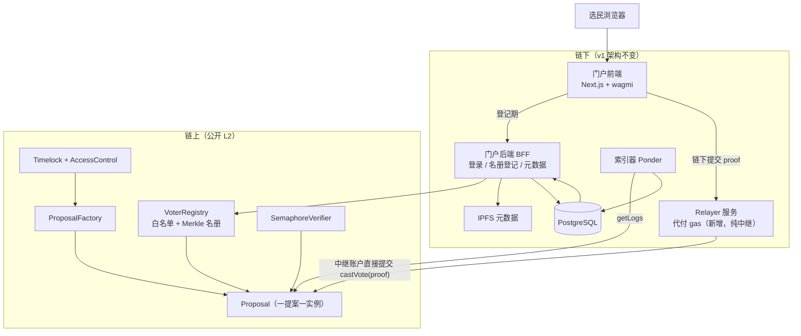
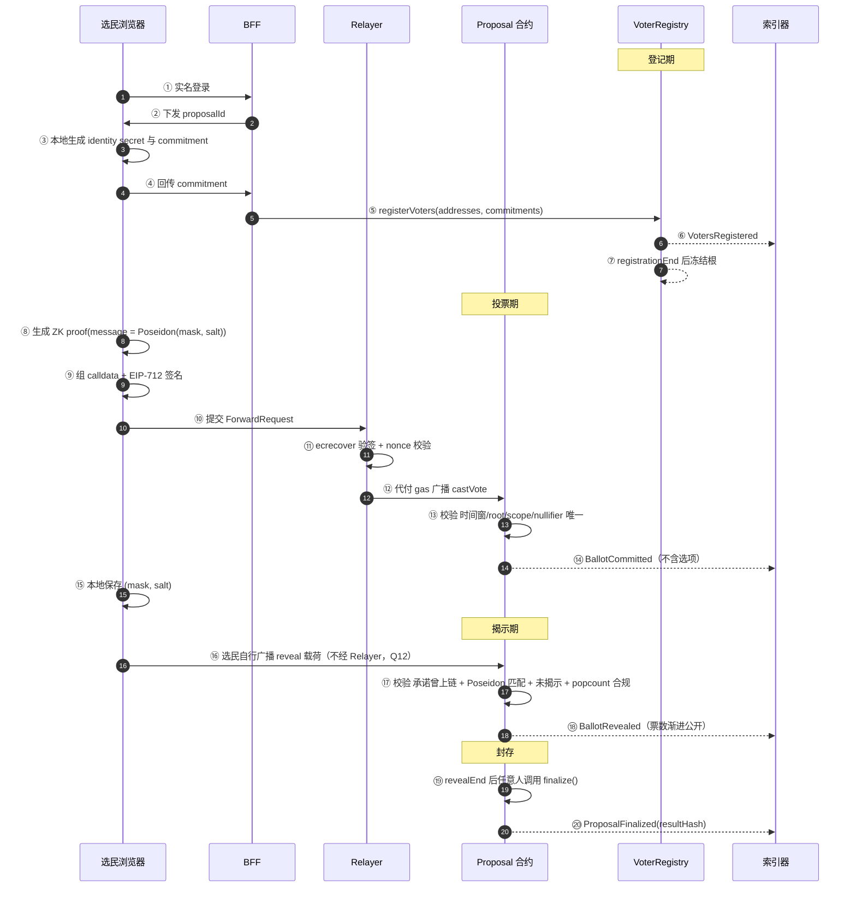

# 区块链去中心化投票系统 · 实现方案 v2.2（决策冻结 + 评审修订 + P5 架构修正）

> 基线：`区块链去中心化投票系统-实现文档.md` v0.1
> v2.0：纳入 4 项决策 + 8 项新增需求，修正 4 处会导致功能不成立的设计冲突
> v2.1：冻结 Q1–Q12，并按 `方案评审报告-v2.1.md` 修复 21 项问题（含 1 项严重漏洞 F-02）
> v2.2：P5 实测证伪 ERC-2771 中继方案，重写 §5.3 为**纯中继**（F-23，架构级修正）
> 全部 22 项修订的清单与状态见 §15

---

## 0. 本轮输入

### 0.1 已冻结决策

| 编号 | 事项 | 结论 | 对架构的影响 |
| --- | --- | --- | --- |
| D2 | 匿名强度 | **全匿名**（隐身份 + 隐选项） | 引入 ZK 凭证 + 承诺投票，见 §2 C1/C2 |
| D4 | 选项模式 | **多选** | 选票编码改为位图，`maxChoices` 受约束 |
| D6 | 链路 | **公开链**（EVM 兼容 L2） | 保留 v1 主方案，联盟链备选作废 |
| D10 | 女巫防护 | 在**不影响其余功能**前提下取最高强度 | 叠加 7 层，见 §9；不引入生物核身 |

### 0.2 新增需求（编号 N1–N7）

| 编号 | 需求 | 采纳状态 |
| --- | --- | --- |
| N1 | 身份准入：管理员预登记上链，已登记者才可投 | ✅ 采纳，实现方式见 §2 C1 |
| N2 | 地址白名单：非白名单地址提交选票由合约层拦截 | ⚠️ **采纳但需改造**：拦截点从「投票交易」前移到「凭证领取」，否则匿名失效 |
| N3 | 链上时间锁：合约自动开/关票，管理员不可提前结束或延时 | ✅ 采纳，**要求移除 v1 的 `PAUSER_ROLE`**，见 §2 C4 |
| N4 | 分步公示：投票期不可查看实时票数，截止后开放 | ✅ 采纳，**必须密码学实现，不能只做 UI 遮挡**，见 §2 C2 |
| N5 | 多提案并行：每提案独立白名单 + 独立时间锁 | ✅ 采纳，采用「一提案一合约实例」 |
| N6 | 结果签名核验：结果生成签名，任何人可验证未被篡改 | ⚠️ **术语修正**：合约无法签名。等价物＝结果哈希锚定，见 §2 C3 |
| N7 | 主体仍为线上投票系统，原有架构不变 | ✅ 采纳；新增 Relayer **服务**（纯中继，**无链上合约组件**），见 §5.3 |

### 0.3 Q1–Q12 冻结记录（2026-09-18 确认）

| # | 事项 | **冻结结论** |
| --- | --- | --- |
| Q1 | 是否引入 Relayer | **引入**（全匿名的必要条件）。★形式为**纯中继**，**非 ERC-2771**——后者经实测证伪，见 §5.3.1 |
| Q2 | 是否接受揭示期渐进公开 | **接受** |
| Q3 | 揭示窗口时长 | **48h** |
| Q4 | 是否保留紧急暂停 | **不保留**（N3 优先，无任何票期干预接口） |
| Q5 | Relayer 免费额度 | **每提案每地址 ≤ 20 次**，超出需自付 |
| Q6 | `maxChoices` 上限 | **≤ 8** |
| Q7 | 生物核身 / 设备指纹 | **一期不叠加**，二期评估 |
| Q8 | 揭示 gas 补贴 | **提供**，但形式为**事后按链上揭示记录报销**，不经 Relayer 代发（见 §15 F-13） |
| Q9 | 未揭示票处理 | **作废**，并在结果页公示作废数量 |
| Q10 | 观察员签名（C3 的 L2） | **不需要** |
| Q11 | 生产主网 | **Base** |
| Q12 | 揭示交易由谁广播 | **选民自行广播**；中继仅用于投票期 |

> 所有 Q 项已关闭，**无剩余阻断项**，可直接进入 P0。

---

## 1. 方案结论速览

| 维度 | 结论 |
| --- | --- |
| 链路 | EVM 兼容 L2（测试 Base Sepolia / 生产 Base） |
| 匿名机制 | **Semaphore v4（Groth16）** 证明「我在名册内且未投过票」 |
| 隐选项机制 | **承诺—揭示双层**：投票期只上链 `ballotCommitment`，投票结束后进入揭示期 |
| 多选实现 | 位图（≤16 选项）+ `maxChoices` 约束，**揭示期校验** |
| 准入实现 | 管理员登记 `地址 → commitment`，两段式：登记期建立名册，投票期靠 ZK 成员证明 |
| 交易提交 | **中继代付 gas**：中继账户**直接**提交 `castVote(proof)`（纯中继，无链上转发框架），**仅服务投票期**；揭示交易由选民自行广播（Q12）。★**禁止**使用 ERC-2771 / EIP-712 转发，见 §5.3.1 |
| 时间控制 | 四段不可变时间窗，合约自动开关，**无任何管理员干预接口** |
| 结果核验 | 链上 `resultHash` 锚定 + 独立复算脚本（无需签名） |
| 合约可升级性 | **不可升级** |

---

## 2. 四处关键冲突与修正（**必读**）

### C1 · 地址白名单 vs 全匿名 —— 冲突，有解

| 项 | 内容 |
| --- | --- |
| **表面描述** | 管理员把合格选民**地址**录入合约白名单，不在白名单的账户提交选票直接拦截 |
| **技术事实** | ① 白名单公开的是**资格**，不公开选票，本身不破坏保密；② **真正破坏匿名的是投票交易的 `sender`** —— 只要选民用登记地址直接发交易，链上即形成 `地址 ↔ nullifier ↔ 选票` 的公开关联，全匿名立即失效 |
| **修正方案** | **两段式准入**：<br/>**阶段①（登记期）**：管理员 `registerVoters(addresses[], commitments[])`，链上建立 `whitelist[addr] = commitment` 与 Merkle 名册根。此阶段「谁有资格」公开，符合 N1/N2。<br/>**阶段②（投票期）**：选民在本地生成 ZK 证明，proof 经**链下信道**交给中继，中继用自己的账户**直接**提交 `castVote(proof)`。链上只出现 `nullifier` 与 `ballotCommitment`，不出现发送者身份。非名册成员**无法构造有效证明**，准入拦截自动生效。<br/>**合约层强制**：`castVote` 拒绝已登记地址直投（`MustUseRelayer`），见 §5.3 |
| **信任模型** | 白名单地址持有者即使知道全部名单，也无法从链上数据反推任何一张票归属。中继只广播，**看不到选民的登记地址**（proof 中不含地址），也看不到选票内容（见 §3.2 表）。残留风险在中继的链下日志，见 §5.3.3 |
| **代价** | 新增 Relayer **服务**（**1 个链下服务，无链上合约组件**）。若**不引入部分中继**，隐身份降级为「谁投了公开、投了什么保密」 |
| **已冻结** | Q1 = **引入 Relayer**（2026-09-18）。§5.3 方案生效，不做降级 |

> **关键结论**：`N2` 的「合约层拦截」在匿名架构下**不能放在 `castVote` 上**，必须放在名册成员证明上。二者拦截效果等价（非名单者根本拿不到有效证明），但后者不与匿名冲突。

### C2 · 「合约内锁定票数」 vs 公开链可读性 —— 必须密码学实现

| 项 | 内容 |
| --- | --- |
| **表面描述** | 投票没结束前任何人不能查看实时票数，合约内锁定票数，截止后自动开放查询 |
| **技术事实** | 公开链上的 storage **任何人可直读**。若选票以明文上链，仅在接口和前端隐藏属于「UI 遮挡」，不构成隐私——任何人用 `eth_getStorageAt` 或区块浏览器都能看到结果 |
| **修正方案** | **承诺—揭示（commit-reveal）双层**：<br/>**投票期**：链上仅存 `ballotCommitment = Poseidon(ballotMask, salt)`，**票数是密码学意义上的不可读**（无法从哈希反推位图）。<br/>**揭示期**：`votingEnd` 之后进入揭示窗口，持明文的任一方提交 `(commitment, ballotMask, salt)`，合约校验哈希匹配后累计。此时投票已结束，**不存在「引导后续投票者跟风」的问题**（需求 N4 的实质诉求已满足）。<br/>**封存**：揭示窗口结束后 `finalize()` 锁定票数与结果哈希 |
| **关键论证** | N4 的防护目标是「防止跟风」，该风险**只在投票期内成立**。揭示期渐进公开不产生跟风风险，反而增强透明度。因此「投票期强保密 + 揭示期渐进公开」是自洽的 |
| **残余风险** | 揭示期内票数对链上观察者是**渐进可见**的（非一次性公布）。若要求揭示期也具备密码学保密性，须引入 MPC / 同态计票 —— 复杂度与审计成本显著上升 |
| **已冻结** | Q2 = **接受**揭示期渐进公开；Q3 = 揭示窗口 **48h**（2026-09-18） |

### C3 · 「合约对结果签名」 —— 术语错误，需替换

| 项 | 内容 |
| --- | --- |
| **表面描述** | 投票结束后合约自动对最终计票结果生成签名，任何人可调用合约接口验证结果未被后端篡改 |
| **技术事实** | EVM 合约**没有私钥，无法产生密码学签名**。任何「合约签名」的表述在实现层都不成立 |
| **修正方案（推荐，L1）** | **结果哈希锚定**：`finalize()` 时计算并永久存储<br/>`resultHash = keccak256(abi.encode(chainId, address(this), proposalId, counts, revealedCount, totalNullifiers))`<br/>并提供 `getResultHash()` / `getCounts()` view 接口。任何第三方读取事件与 storage 后可**完全离线复算**，比对哈希一致即证明未被篡改 |
| **可选的 L2 补充** | 若业务上必须见到「签名」字样：由**观察员/审计方**用 EIP-712 对 `resultHash` 签名，链下 `ecrecover` 验签。**信任模型不同**——这是「相信观察员」，不是「相信合约」，须在公示页明确标注 |
| **可选的 L3** | 链上 `attest(resultHash, sig)` 由多签合约记录。本质是另一笔交易，不提供额外密码学保证 |
| **结论** | **N6 用 L1 即可闭环，且实现成本极低**（新增 1 个 view 接口 + 1 个脚本），与你的判断一致。建议不引入 L2/L3 |

### C4 · 「管理员无法提前结束」 vs v1 的暂停能力 —— 直接冲突

| 项 | 内容 |
| --- | --- |
| **冲突点** | v1 设计中有 `PAUSER_ROLE`，可调用 `setPaused()` 在投票中途停投。这与 N3「后台管理员无法人为提前结束或延时开放投票」**直接冲突** |
| **修正方案** | **移除 `PAUSER_ROLE` 与全部暂停接口**。投票开关 100% 由 `block.timestamp` 与不可变时间参数决定 |
| **修正后果** | 合约无法人为止损。若上线后发现合约漏洞，只能：① 停止前端入口；② 公告作废该提案；③ 重新部署新提案合约 |
| **反制措施** | 上线前完成审计 + 测试网灰度（v1 §6.3）；提案合约不可升级但 `Factory` 可部署新版本，作为事实上的「紧急替代路径」 |
| **已冻结** | Q4 = **不保留任何暂停能力**（2026-09-18）。备选方案（Timelock 延时暂停）已作废。代价与反制措施见上两行 |

---

## 3. 需求 → 设计映射

| 需求 | 设计落点 | 验证方式 |
| --- | --- | --- |
| N1 身份准入 | `VoterRegistry.registerVoters()`，登记期上链 `whitelist[addr]=commitment` + Merkle 根 | 未登记地址生成的证明无法通过验证器 |
| N2 白名单拦截 | ZK 成员证明 + 交易经中继提交 | 非名册 commitment 的 proof 100% revert |
| N3 时间锁 | 四个不可变时间参数 + `require(block.timestamp ...)`；**无暂停接口** | 边界时刻 ±1s 行为符合预期 |
| N4 分步公示 | 投票期只存 `ballotCommitment`；`getCounts()` 在 `finalized` 前 revert | 投票期任意人无法从链上反推任何一票 |
| N5 多提案 | `ProposalFactory` + 一提案一 `Proposal` 合约实例 | 提案 A 的名册根变更不影响提案 B |
| N6 结果核验 | `resultHash` 存储 + `getResultHash()` + 独立复算脚本 | 仅凭 RPC 地址可复算出同一哈希 |
| N7 架构不变 | 门户前端 / BFF / 索引器 / PostgreSQL 保持 v1 结构 | 仅新增 Relayer 一个服务 |

---

## 4. 架构

### 4.1 组件总览



### 4.2 信任模型（谁会看到什么）

| 角色 | 能看到 | **看不到** | 需要被信任的程度 |
| --- | --- | --- | --- |
| 链上观察者 | 谁有资格、有多少人投了票、承诺值 | 每张票的选项、票与人的对应关系 | 无需信任 |
| 中继服务 | 交易 calldata 中的 `nullifier`、`commitment`，以及**链下**收到的请求来源（IP/会话） | 选项明文（投票期为承诺）；**选民的登记地址**（proof 不含地址，中继也无从得知） | 需信任其**不审查、不丢弃**交易；★链下日志不得记录「proof ↔ 来源」映射，见 §5.3.3 |
| BFF / 运维 | 实名登记表、地址↔commitment 映射 | 无法从链上数据反推任何一票归属 | 需信任其**名册准确性** |
| 管理员 | 同上 | 无法提前开/关票、无法改票、无法改结果 | 需信任其**不滥用名册登记权** |
| 选民自己 | 自己的选票明文（用于揭示期提交） | 他人的选票 | — |

> 结论：**「名册准确性」是唯一需要信任管理员的环节**，且该环节全程上链留痕、可事后审计；选票内容与结果不可篡改。

**匿名性边界（评审修订 F-11，实现与文案均须遵守）**

| 能成立 | 不能成立 |
| --- | --- |
| ✅ **不可链接到真实身份**——`nullifier = Poseidon(identitySecret, scope)`，与公开的 `commitment` 之间无可行反推路径（Poseidon 单向性） | ❌ **完全不可链接**——`BallotCommitted` 事件同时记录 `nullifier` 与 `ballotCommitment`，揭示后可建立 `nullifier ↔ 选项` 的公开关联 |
| ✅ **不可跨提案关联**——`scope` 含提案地址，同一选民在不同提案中的 `nullifier` 不同 | ❌ 票数在揭示期为一次性公布（本方案为渐进公开） |

> 对外表述必须使用「**选票不可关联到投票人身份**」，**不得**使用「完全匿名/不可追溯」。公示页需明示：假名 `nullifier` 与选项的关联在链上可见，但该假名无法映射回任何自然人或地址。

---

## 5. 合约设计

### 5.1 模块划分

```text
contracts/
├── ProposalFactory.sol        # 创建提案、索引、全局角色
├── Proposal.sol               # 单提案状态机（登记→投票→揭示→封存）
├── VoterRegistry.sol          # 每提案独立：地址白名单 + commitment Merkle 组
├── verifier/
│   └── SemaphoreVerifier.sol  # Groth16 验证器（官方库/生成，禁止手写）
├── libs/
│   ├── BallotCodec.sol        # 位图编解码 + popcount
│   └── Errors.sol
└── governance/
    └── Timelock.sol           # 仅承载角色管理，不承载任何投票控制权
```

| 模块 | 可升级 | 理由 |
| --- | --- | --- |
| `Proposal` | ❌ 不可升级 | 提案期内合约不可变，换取「无后台干预」的可信度（支撑 N3） |
| `ProposalFactory` | ❌ 不可升级 | 新版本部署新 Factory，避免代理存储冲突 |
| `VoterRegistry` | ❌ 不可升级 | 名册根变更本身即业务行为，无需代理 |
| ~~`MinimalForwarder`~~ | — | **已移除**：ERC-2771 经实测证伪（见 §5.3.1）。纯中继**无链上组件**，本行不再适用 |
| 前端 / BFF / Relayer | ✅ 滚动发布 | 不在信任边界内 |

### 5.2 状态机与时间轴

```text
 登记期         空档期        投票期                揭示期           已封存
 REGISTRATION → IDLE   →    VOTING       →      REVEAL       →   CLOSED → FINALIZED
    │             │            │                   │                │
    │             │            │                   │                └─ finalize() 后才可读结果
    │             │            │                   └─ 提交明文，累计票数（仅此阶段可揭示）
    │             │            └─ 仅接收承诺，票数密码学不可读
    │             └─ 不可登记、不可投票（消除「空档期仍可改名册」的歧义，F-01）
    └─ 管理员登记名册；registrationEnd 后冻结根
```

| 时间参数 | 约束 | 可修改 |
| --- | --- | --- |
| `registrationEnd` | < `votingStart` | ❌ 创建后不可改 |
| `votingStart` | ≥ 创建时间 + 最短登记期 | ❌ |
| `votingEnd` | > `votingStart` | ❌ |
| `revealEnd` | `votingEnd` + 揭示窗口（默认 48h） | ❌ |

```solidity
/// 评审修订 F-01：新增 IDLE 与 CLOSED，消除两处歧义——
///  ① 空档期（registrationEnd ≤ t < votingStart）返回 REGISTRATION，会让 registerVoters 仍可调用；
///  ② 已过 revealEnd 但未 finalize() 时返回 FINALIZED，与实际未封存状态矛盾。
enum Phase { REGISTRATION, IDLE, VOTING, REVEAL, CLOSED, FINALIZED }

function phase() public view returns (Phase) {
    if (block.timestamp < registrationEnd) return Phase.REGISTRATION;
    if (block.timestamp < votingStart)     return Phase.IDLE;
    if (block.timestamp < votingEnd)       return Phase.VOTING;
    if (block.timestamp < revealEnd)       return Phase.REVEAL;
    return finalized ? Phase.FINALIZED : Phase.CLOSED;
}

/// 【硬约束】登记有效性只依赖 registrationEnd，绝不依赖 phase()
modifier onlyRegistrationPhase() {
    if (block.timestamp >= registrationEnd) revert RegistrationClosed();
    _;
}
```

> **【硬约束 1】** 不存在 `setPhase`、`pause`、`extend`、`earlyClose` 等任何写接口。阶段完全由 `block.timestamp` 推导。
> **【硬约束 2】** `registerVoters()` 的有效性判断**禁止使用 `phase()`**，必须直接比较 `block.timestamp < registrationEnd`。否则 `IDLE` 空档期将成为名册篡改窗口，直接破坏 INV-7。
> **【硬约束 3】** `CLOSED`（可封存未封存）状态下 `getCounts()` 仍须 revert。`_counts` 的原始 storage 在公开链上客观可读，这是公开链的固有限制，UI 与接口层必须统一显示「计票中」，**不得把揭示尾期数据当作最终结果**（F-14）。

### 5.3 Relayer（新增服务，**纯中继**）

> **★ 本节已于 P5 重写。** 原设计选择「EIP-712 + ERC-2771 `MinimalForwarder`」，
> 该选择经**实测证伪**：ERC-2771 会把签名者地址明文写入交易 calldata，
> 与「隐身份」目标直接冲突。详见 §15 F-23（含复现命令）。
> 以下为修正后的方案。

| 项 | 说明 |
| --- | --- |
| 必要性 | **是全匿名的必要条件**，不是性能优化。无中继 ⇒ `tx.from ↔ 选票` 关联成立 |
| 协议 | **纯中继（plain relayer）**：不引入任何链上转发框架，**不使用 EIP-712 签名** |
| 选民侧 | 本地生成 ZK `proof` → 经**链下加密信道**交给中继（proof 不上链、不签名） |
| 中继侧 | 用自己的账户构造 `castVote(proof)` 交易并签名广播 → 代付 gas |
| **合约层强制** | `castVote` 校验 `!isRegistered(msg.sender)`，**已登记地址直投一律 revert `MustUseRelayer`** |
| 中继能看到什么 | `proof`（含 `nullifier` 与 `message` 承诺）。**看不到选项明文**（投票期为承诺） |
| 中继看不到什么 | 选民的**登记地址**、选项明文 |
| 服务范围 | **仅承担 `castVote`**。`reveal` 由选民自行广播（Q12），中继不接触揭示明文（F-13） |
| **无单点依赖** | 任何账户均可自任中继；选民亦可用一次性地址自付 gas 提交。平台中继仅提供「免 gas」便利 |
| 免费额度 | **已冻结 Q5**：每提案每地址 ≤ 20 次，超出需自付（额度按链上 `BallotCommitted` 计数，不依赖身份） |

```solidity
// 纯中继：选民侧只需产出 proof；中继侧只是普通的交易发送者
// —— 合约接口不因「谁提交」而不同，故无需任何转发框架
interface IProposal {
    function castVote(ISemaphore.SemaphoreProof calldata proof) external;
}

// 合约层的唯一约束（见 §15 F-23）：
//   if (IVoterRegistry(REGISTRY).isRegistered(msg.sender)) revert MustUseRelayer();
```

#### 5.3.1 为什么不是 ERC-2771（★实测证伪，禁止重新引入）

| 项 | 说明 |
| --- | --- |
| 原判断 | 「Relayer 是全匿名的必要条件」→ **正确** |
| 原实现 | 「用 EIP-712 签名 + ERC-2771 转发」→ **错误** |
| 证伪机制 | `ERC2771Forwarder._execute` 执行 `abi.encodePacked(request.data, request.from)`，且 **`request.from` 本身就是 `execute()` calldata 的一部分** |
| 实测结果 | 一笔 868 字节的中继调用，`tx.from` 为中继账户，而**签名者地址完整出现于其 calldata** |
| 根本原因 | ERC-2771 的设计目标是让目标合约**识别出真实用户**（`_msgSender()` 返回签名者）；而全匿名要求合约**无法识别用户**——两者目标相反 |
| 结论 | ERC-2771 隐藏的是「谁付 gas」，**不是「谁在操作」**。它对本项目不仅多余，而且**以机制保证地址上链** |
| 澄清 | **ERC-2771 本身无安全缺陷**（其重放防护经测试验证完整）。不采用它是**机制与隐私目标冲突**，而非质量问题——该区分可避免它被错误拒绝于不需要匿名的场合（免 gas 的公开治理投票、空投领取等） |
| 证据留存 | `contracts/harness/ERC2771LeakReference.sol`（禁用性说明 + 复现探针）、`test/p5.metatx.test.ts` 的身份泄露判定用例 |
| 防护 | 硬约束 **HC-20** 机械禁止 `Proposal` 引入 `ERC2771Context` / `_msgSender` / `trustedForwarder` 中任一项 |

#### 5.3.2 纯粹中继下的重放防护

纯中继没有 EIP-712 签名，故 F-10 原设计的「nonce / deadline / data 绑定」保护**不再适用**。
替代保护比原设计**更根本**，因为它绑定在投票语义上而非传输层上：

| 攻击 | 防护 | 依据 |
| --- | --- | --- |
| 同一 proof 重复提交 | `AlreadyVoted()` | `_nullifierUsed[proof.nullifier]`，nullifier 由 ZK 电路派生、每人每提案唯一 |
| 同一 proof 投向另一提案 | `InvalidScope()` | `proof.scope != SCOPE`，`SCOPE = H(domain, chainId, proposal)` 全局唯一 |
| 跨链重放 | `InvalidScope()` | `chainId` 已入 `SCOPE` |
| 中继篡改 proof 内容 | `InvalidProof()` | proof 由选民生成并绑定 `message`（选票承诺），篡改任一字段即校验失败 |
| 中继重复使用同一交易 | 被链接受但不重复计数 | `nullifier` 唯一性使第二次必然 revert |

> **【硬约束 5】** 上述第一条是**重放防护的全部**，因此 `_nullifierUsed` 的写入时机
> 必须严格晚于 ZK 验证通过（F-05），否则攻击者可用伪造 nullifier 预占他人的票据位。

#### 5.3.3 残留风险（链下，合约不可覆盖）

**中继在链下知道每个 proof 的来源。** 中继收到请求时能看到 IP、会话、时间。
若中继记录「proof ↔ 请求来源」的映射，则它**单独**即可完成身份与选票的关联。

处置：
- 中继服务**不得持久化** proof 与请求来源的对应关系（写入日志前必须剥离来源字段）；
- 采用**批量转发**（积攒若干请求后按随机顺序提交）以打散时序关联；
- 该风险属中继运营安全，**合约层无法覆盖**，须在运维规范中明确；
- 用户侧可选自任中继（一次性地址）以完全规避。


### 5.4 核心数据结构

```solidity
struct ProposalConfig {
    bytes32 metadataCID;     // IPFS：议题、候选人、章程
    uint64  registrationEnd;
    uint64  votingStart;
    uint64  votingEnd;
    uint64  revealEnd;
    uint8   optionCount;     // ≤ 16
    uint8   maxChoices;      // 每人最多可选数
    address verifier;        // SemaphoreVerifier
    // 无 forwarder 字段：ERC-2771 经实测证伪（§5.3.1），
    // 纯中继不需要任何链上转发器地址 —— 中继只是普通的交易发送者
}

struct ProposalState {
    bytes32 votersRoot;      // 登记期增长中的名册根
    bytes32 frozenRoot;      // 登记期结束时固化的根，投票期唯一有效（F-06）
    bytes32 ballotsRoot;     // 已投票承诺的渐进 Merkle 根
    uint64  nullifierCount;  // 已投票人数
    uint64  revealedCount;   // 已成功揭示票数
    uint64  rejectedCount;   // 被作废的揭示次数（Q9 公示口径）
    uint64  totalMarks;      // popcount 累计器，供 INV-1 断言（F-07）
    bool    finalized;
    bytes32 resultHash;
}

/// Semaphore v4 证明结构：4 个公开信号 + 8 个证明点（F-04）
/// 【硬约束】nullifier 与 message 必须从 proof 读取，禁止作为独立参数传入，
///          否则事件记录值与真实证明脱节，索引器与审计数据将失真（F-03）。
struct ZKProof {
    uint256 merkleTreeRoot;  // 必须等于 frozenRoot
    uint256 nullifier;       // = Poseidon(identitySecret, scope)
    uint256 message;         // = ballotCommitment，由电路绑定，不可伪造
    uint256 scope;           // = H(chainId, address(this))
    uint256[8] points;
}

// 揭示期输入
struct RevealPayload {
    bytes32 ballotCommitment;
    uint16  ballotMask;      // bit i = 选中选项 i
    uint256 salt;
}

enum RevealStatus { NONE, ACCEPTED, REJECTED }   // F-08

uint64[16] internal _counts;                    // 各选项得票数，仅 finalized 后可读
mapping(uint256 => bool)   internal _nullifierUsed;   // L1 防重复
mapping(bytes32 => bool)   internal _commitmentCast;  // ★ 该承诺确曾于投票期上链（F-02，严重）
mapping(bytes32 => RevealStatus) internal _revealStatus; // L2 防重复 + 防反复重试
```

### 5.5 接口与事件

```solidity
// ============ VoterRegistry ============
interface IVoterRegistry {
    event VotersRegistered(
        uint256 indexed proposalId,
        uint256 count,
        bytes32 newRoot
    );
    event VotersRootFrozen(uint256 indexed proposalId, bytes32 finalRoot, uint32 eligibleCount);

    /// @notice 登记期专用；写入 whitelist[addr]=commitment 并更新 Merkle 组
    /// 【硬约束】有效期判断用 block.timestamp < registrationEnd，禁用 phase()
    /// 【硬约束】单批 ≤ 50 地址（每地址约 60k–100k gas，见 §9.2 F-09）
    function registerVoters(
        address[] calldata voters,
        uint256[] calldata commitments
    ) external onlyRole(REGISTRAR_ROLE);

    /// @notice 无权限门槛：registrationEnd 之后任何人可调用一次，固化名册根（F-06）
    ///         幂等；此后 votersRoot 不可再变（支撑 INV-7）
    function freezeVotersRoot() external returns (bytes32 root);

    function isRegistered(address voter) external view returns (bool);
    function commitmentOf(address voter) external view returns (uint256);
    function frozenRoot() external view returns (bytes32);
}

// ============ Proposal ============
interface IProposal {
    // ---- 事件 ----
    event BallotCommitted(
        uint256 indexed proposalId,
        bytes32 indexed nullifierHash,
        bytes32 ballotCommitment,
        uint256 leafIndex
    );
    event BallotRevealed(
        uint256 indexed proposalId,
        bytes32 indexed ballotCommitment,
        uint256 revealedCount
    );
    event RevealRejected(uint256 indexed proposalId, bytes32 ballotCommitment, uint8 reason);
    event ProposalFinalized(
        uint256 indexed proposalId,
        uint64[16] counts,
        uint64 revealedCount,
        uint64 nullifierCount,
        bytes32 resultHash,
        uint64 finalizedAt
    );

    // ---- 投票期 ----
    /// @notice 由 Relayer 代提交。proof.message 即 ballotCommitment，由电路绑定
    /// 【硬约束】写入 _nullifierUsed 必须在 verifyProof 通过之后（F-05）
    /// 【硬约束】校验顺序：时间窗 → frozenRoot → scope → nullifier 未用(读) → verifyProof → 写入
    function castVote(ZKProof calldata proof) external;

    // ---- 揭示期 ----
    /// @notice 任何人可调用；无需 sender 是选民。选民自行广播（Q12）
    function reveal(RevealPayload[] calldata payloads) external;

    // ---- 封存 ----
    /// @notice revealEnd 之后任何人可调用，幂等
    function finalize() external;

    // ---- 查询：分步公示的强制点 ----
    /// @notice 【硬约束】finalized 之前必须 revert
    function getCounts() external view returns (uint64[16] memory);
    function getResultHash() external view returns (bytes32);
    function isFinalized() external view returns (bool);

    // ---- 审计查询（不泄露选项）----
    function isNullifierUsed(uint256 nullifier) external view returns (bool);
    function isRevealed(bytes32 ballotCommitment) external view returns (RevealStatus);
    function phase() external view returns (Phase);
    function getConfig() external view returns (ProposalConfig memory);
}

// ============ ProposalFactory ============
interface IProposalFactory {
    event ProposalCreated(
        uint256 indexed proposalId,
        address indexed proposal,
        address indexed creator,
        bytes32 metadataCID,
        uint64 votingStart,
        uint64 votingEnd
    );

    function createProposal(ProposalConfig calldata cfg)
        external onlyRole(CREATOR_ROLE) returns (uint256 proposalId, address proposal);

    function proposalOf(uint256 proposalId) external view returns (address);
    function proposalCount() external view returns (uint256);
    /// @notice 批量查询某地址在多个提案中的准入状态
    function eligibilityOf(address voter, uint256[] calldata proposalIds)
        external view returns (bool[] memory);
}
```

> **多提案设计取舍**：采用「一提案一合约实例」而非「单合约 + `proposalId`」。理由是白名单、时间锁、名册根天然隔离，单提案的缺陷不扩散；代价是每提案部署约 2–3M gas，在 L2 上成本可忽略。实现上 `proposalId` 由 `immutable` 提供，**函数参数不再重复传入**（评审修订 F-12），事件中保留 `proposalId` 供索引器使用。

**`reveal()` 校验顺序（评审修订 F-02，★严重，缺一即可凭空造票）**

```solidity
function _revealOne(RevealPayload calldata p, ProposalConfig storage cfg) internal {
    // ① 【必须】该承诺确曾在投票期上链 —— 缺少此行，攻击者可自造 (mask, salt)
    //    计算 Poseidon(mask, salt) 后直接揭示，凭空生成任意数量选票
    if (!_commitmentCast[p.ballotCommitment]) revert CommitmentNotCast();
    // ② 未揭示过，且未在拒绝后被反复重试
    if (_revealStatus[p.ballotCommitment] != RevealStatus.NONE) revert AlreadyRevealed();
    // ③ 明文与承诺匹配
    if (Poseidon.hash2(p.ballotMask, p.salt) != uint256(p.ballotCommitment))
        revert CommitmentMismatch();
    // ④ 多选合规（投票期无法校验，只能在此处校验，见 §7）
    if (!BallotCodec.validate(p.ballotMask, cfg.optionCount, cfg.maxChoices)) {
        _revealStatus[p.ballotCommitment] = RevealStatus.REJECTED; // 标记，禁止重试
        ++state.rejectedCount;
        emit RevealRejected(proposalId, p.ballotCommitment, REASON_CHOICE_LIMIT);
        return;                                                    // 不 revert，保证批量揭示不被单条打断
    }
    // ⑤ 写入状态与累计
    _revealStatus[p.ballotCommitment] = RevealStatus.ACCEPTED;
    state.totalMarks += BallotCodec.popcount(p.ballotMask);
    for (uint8 i = 0; i < cfg.optionCount; ++i)
        if (p.ballotMask & (uint16(1) << i) != 0) ++_counts[i];
    ++state.revealedCount;
    emit BallotRevealed(proposalId, p.ballotCommitment, state.revealedCount);
}
```

### 5.6 关键不变量

| 编号 | 不变量 | 断言 |
| --- | --- | --- |
| INV-1 | 票数守恒 | `sum(counts) == totalMarks`（F-07 新增计数器） |
| INV-2 | 揭示不超额 | `revealedCount ≤ nullifierCount` |
| INV-3 | 一人一票 | 每个 `nullifier` 至多对应一个 `ACCEPTED` 承诺 |
| INV-4 | 选项合法 | 任一 `ACCEPTED` 的 `ballotMask < 2^optionCount` 且 `popcount ≤ maxChoices` |
| INV-5 | 阶段单调 | `phase()` 只能前进，永不回退 |
| INV-6 | 封存不可逆 | `finalize` 成功次数 ≤ 1，且 `counts` 此后恒定 |
| INV-7 | 名册冻结 | `registrationEnd` 后 `votersRoot` 不再变化，且 `frozenRoot` 一旦非零不可再改 |
| INV-8 | 提交有效性 | 任一被接受的揭示，其 `ballotCommitment` 必然满足 `_commitmentCast == true`（F-02） |
| INV-9 | 写入滞后 | `_nullifierUsed[n] = true` 必然发生在 `verifyProof` 成功之后（F-05） |

---

## 6. 端到端时序



**失败分支**

| 阶段 | 条件 | 合约行为 | 前端提示 |
| --- | --- | --- | --- |
| 投票 | 不在投票期 | `NotInPhase(VOTING)` | 投票未开始 / 已结束 |
| 投票 | Merkle root 不匹配冻结根 | `RootMismatch()` | 名册已更新，请刷新凭证 |
| 投票 | `proof.scope` 不等于 `H(chainId, proposal)` | `InvalidScope()` | 凭证与提案不匹配 |
| 投票 | `nullifier` 已使用 | `AlreadyVoted()` | 您已参与本提案投票 |
| 投票 | ZK 验证失败 | `InvalidProof()` | 您不在本提案名册内 |
| 揭示 | 承诺不曾于投票期上链 | `CommitmentNotCast()` | 揭示数据无效 |
| 揭示 | 哈希不匹配 | `CommitmentMismatch()` | 揭示数据与投票记录不符 |
| 揭示 | `popcount > maxChoices` | **不 revert**，标记 `REJECTED` + `RevealRejected`，`rejectedCount++` | 选择超过上限，该票作废 |
| 揭示 | 已揭示 / 已被判废 | `AlreadyRevealed()` | 该票已处理 |
| 查询 | `!finalized` | revert `ResultLocked()` | 结果将在投决结束后公布 |
| 封存 | 重复调用 | revert `AlreadyFinalized()` | — |

---

## 7. 多选与位图编码

```solidity
library BallotCodec {
    /// @notice 位图合法性：位宽不越界 且 选中数不超限
    /// 评审修订 F-21：原 `optionCount >= 16` 为 off-by-one，会错误拒绝 16 选项配置
    function validate(uint16 mask, uint8 optionCount, uint8 maxChoices)
        internal pure returns (bool)
    {
        if (optionCount == 0 || optionCount > 16) return false;
        if (maxChoices == 0 || maxChoices > optionCount) return false;
        if (optionCount < 16 && mask >> optionCount != 0) return false;  // 越界位
        return popcount(mask) <= maxChoices;
    }

    /// @notice 供 reveal 累计使用（评审修订 F-07）
    function popcount(uint16 x) internal pure returns (uint8 c) {
        while (x != 0) { c += uint8(x & 1); x >>= 1; }   // 16 轮上界，无 gas 风险
    }
}
```

| 设计点 | 说明 |
| --- | --- |
| 位宽 | `uint16`，支持 1–16 个选项 |
| 投票期校验 | **无法校验 `maxChoices`**——`ballotCommitment` 是哈希，合约在投票期看不到位图 |
| 揭示期校验 | `validate()` 在揭示时执行；违规票**作废**并计入 `rejectedCount`，结果页公示作废数量（Q9） |
| 前端义务 | **必须**在生成承诺前本地校验 `popcount ≤ maxChoices`。服务端**不得**代替校验（服务端一旦看到位图即破坏隐选项，见 AS-11） |
| **已冻结 Q6** | `maxChoices ≤ 8`。若业务需要接近「全选」，应拆分为多个独立单选提案，而非放宽上限 |
| **已冻结 Q9** | 未揭示票与违规票均**作废**，`rejectedCount` 在结果页单独公示，使「未计入票数」公开可核 |

> **这是多选 + 隐选项的必然代价**：为了隐藏选项，投票期失去对选择数量的校验能力，只能把校验推迟到揭示期。若业务上不可接受「违规票作废」，替代方案是投票期明文上链——但那样 N4 与 D2 同时失效。**结论：接受揭示期校验。**

---

## 8. 女巫防护（D10：不影响其余功能的前提下取最高强度）

| # | 措施 | 强度增益 | 对功能性影响 | 采纳 |
| --- | --- | --- | --- | --- |
| S1 | 地址白名单唯一登记（管理员预登记） | 高 | 无 | ✅ |
| S2 | 一真实身份 ↔ 一 `identitySecret` ↔ 一 commitment | 高 | 无 | ✅ |
| S3 | `nullifier` 唯一性（合约强制，L1 防重） | 高 | 无 | ✅ |
| S4 | `commitment` 唯一揭示（合约强制，L2 防重） | 中 | 无 | ✅ |
| S5 | 登记期结束后 `votersRoot` 冻结，投票期不可新增 | 高 | 无 | ✅ |
| S6 | 登记时地址签名挑战（证明地址控制权，防批量伪造） | 中 | 需多一次钱包签名 | ✅ |
| S7 | 白名单规模与参与率异常监控（链下告警） | 中 | 无 | ✅ |
| S8 | Relayer 层单地址提交频率限制 | 中 | 极端场景限流 | ✅ |
| S9 | 每个 commitment 只能插入名册一次 | 中 | 无 | ✅ |
| S10 | 投票押金（需代币） | 高 | 引入代币，**合规风险** | ❌ 不采纳 |
| S11 | 生物核身 / 设备指纹 | 高 | 引入隐私与合规负担 | ❌ 一期不采纳（**已冻结 Q7**：二期评估） |

**不采纳 S10 的理由**：引入代币与「投票权凭证不具金融属性」的硬约束冲突（见 v1 §1.5）。若确需经济门槛，建议改为**链下白名单审核 + 现场核验**，不引入链上价值物。

---

## 9. 安全与成本

### 9.1 风险与防护（在 v1 基础上增量更新）

| # | 风险 | 本方案下的变化 | 防护 |
| --- | --- | --- | --- |
| R1 | 重入 | 无变化 | CEI + `nonReentrant`；无原生代币转账 |
| R2 | 女巫 | **强化** | S1–S9 九项叠加 |
| R3 | 抢跑 / 跟风 | **显著降低** | 投票期票数密码学不可读（N4），跟风与 MEV 动机大幅削弱 |
| R4 | 权限泄漏 | **降低**（无暂停权）但新增「名册登记权」受关注 | 登记期上链留痕 + 事件告警；`REGISTRAR_ROLE` 置于 Timelock；登记期后可审计名册快照 |
| R5 | 时间操纵 | 无变化 | 时间窗容差 ≥ 60s，不在边界做敏感逻辑 |
| R7 | 证明重放 | 无变化 | `scope = H(chainId, proposalAddress)` |
| **R13** | **Relayer 审查** | **新增** | ① 开放任一 Relayer 准入；② 备选直连路径（牺牲匿名）；③ 事件监控广播延迟 |
| **R14** | **揭示期弃权** | **新增** | ① 前端投票后立即引导一键揭示；② 未揭示票作废并在结果页公示数量（**已冻结 Q9**）；③ **已冻结 Q8**：提供事后 gas 报销（不经 Relayer），但因窗口不可延长（AS-17），报销只能提高意愿、**无法兜底** |
| **R15** | **Relayer 提前看到明文** | **新增** | 揭示内容即将公开，时差信息价值为 0；投票期 payload 为承诺，Relayer 无法获知选项 |
| **R16** | **登记权滥用（塞入虚假选民）** | **新增** | ① `REGISTRAR_ROLE` 走 Timelock；② 登记事件永久留痕；③ 名册快照存 IPFS 供事后比对；④ 公示「登记总数」与「参与率」 |
| **R17** | **`reveal` 凭空造票** | **新增（★严重）** | 揭示时必须校验 `_commitmentCast[commitment] == true`，否则任意人可自造「明文—承诺」对并直接揭示，无上限增票。详见 §5.5 伪代码 ①（F-02） |
| **R18** | **中继签名范围不足** | **新增** | EIP-712 必须绑定 `to` 与 `keccak256(data)`，并校验 `deadline`；否则同一签名可跨 calldata / 跨提案重放（F-10） |

> 未列出的风险编号（R6、R8–R12）沿用 v1 §5.1，本方案未改变其结论（F-18）。

### 9.2 Gas 成本（量级估算，以实测为准）

| 操作 | 估算 gas | 说明 |
| --- | --- | --- |
| `createProposal`（部署新实例） | 2,000,000 – 3,000,000 | 一次性，L2 上可忽略 |
| `registerVoters`（每地址） | 60,000 – 100,000 | 含 `whitelist` SSTORE + LeanIMT 插入；**单批 ≤ 50 地址**（F-09 修正：原 20–25k / 200 地址严重低估） |
| `castVote`（含 Groth16 验证） | 280,000 – 400,000 | 主要成本项 |
| `reveal`（单条） | 30,000 – 60,000 | 支持批量揭示，摊薄基础费 |
| `finalize` | 40,000 – 60,000 | O(1)，不遍历票据 |
| **单票合计（投票 + 揭示）** | **约 310,000 – 460,000** | L2 上约合 0.001–0.01 USD（依 gas price 波动） |

**优化要点**

| # | 做法 | 收益 |
| --- | --- | --- |
| G1 | 部署 L2 而非 L1 | 单票成本降至 L1 的 1/20 ~ 1/100 |
| G2 | 票据明细只发事件，不写 storage 数组 | 每票省约 20k |
| G3 | `reveal` 支持批量（`RevealPayload[]`） | 摊薄 21k 基础费 |
| G4 | 位图编码多选，1 个 `uint16` 承载全部选择 | 相比「每选项一槽」省 15 个 slot |
| G5 | 名册用 Merkle 根而非 `mapping(address=>bool)` 全量上链 | 登记成本与查询成本双降 |
| G6 | 验证器地址、链 ID、Factory 地址设为 `immutable` | 读取约 100 gas vs 2,100 gas |
| G7 | custom errors 替代字符串 | 部署体积与 revert 成本下降 |
| G8 | 校验顺序：时间窗 → `frozenRoot` → `scope` → `nullifier` 未用（只读） → **ZK 验证** → **写入 `nullifierUsed`** | 无效交易尽早失败；**写入必须严格在验证通过之后**，否则可用伪造 `nullifier` 批量写脏状态、DoS 合法选民（F-05，硬约束） |
| G9 | Relayer 代付使选民钱包零 gas 需求 | 降低用户流失，成本转由平台承担 |
| G10 | `reveal` 批量提交 + 单条失败不 revert 整批 | 单笔摊薄 21k 基础费，避免一条坏票拖垮整批（F-02 伪代码） |
| G11 | `getCounts()` 返回定长 `uint64[16]` | view 调用零成本，但**须按 `optionCount` 截断输出**，避免前端展示未使用槽位 |

---

## 10. 实施阶段

| 阶段 | 内容 | 产出 | 完成标准（DoD） | 依赖 |
| --- | --- | --- | --- | --- |
| P0 | 环境搭建、参数冻结 | Foundry 工程 + CI + `.env.example` | `forge build/test` 零错零警；`anvil` 可启；前端可访问 | §11（Q 项**已全部关闭**）；v1 遗留 F1/F3/F5/F6/F7/F10 |
| P1 | 基础库 `BallotCodec` / `Errors` / 角色 | 纯函数库 + 单测 | 行覆盖 ≥ 95%；位图边界全过 | — |
| P2 | `VoterRegistry` + 白名单 / Merkle 名册 | 登记模块 | 非登记地址无法生成有效 commitment；根冻结后不可改 | — |
| P3 | `Proposal` 状态机（**先不含 ZK**） | 四阶段流转 + 承诺 / 揭示 / 封存 | INV-2/4/5/6/7 全过；`getCounts()` 在 `finalized` 前 revert | P2 |
| P4 | Semaphore 集成 | Verifier 接入 `castVote` | 伪造 proof、错误 root、错误 scope、跨提案重放 **100% revert** | P3 |
| P5 | 纯中继 + 匿名准入 | 中继账户直接提交 `castVote(proof)`；合约拒绝已登记地址直投 | ★交易 calldata 与事件中均不含选民地址；已登记地址直投必 revert `MustUseRelayer`；同一 proof 重复提交与跨提案提交必拒 | P4 |
| P6 | 不变量与模糊测试 | `test/invariant` + CI fuzz | INV-1~7 在 512×64 下无破坏；Slither 无 High/Medium | P5 |
| P7 | `ProposalFactory` 多提案 | 一提案一实例 + 批量资格查询 | 提案 A 名册变更对 B 零影响 | P3 |
| P8 | 部署脚本 + Timelock + 多签 | `forge script` + `deployments/*.json` | anvil 二次执行地址一致；部署者无业务角色；浏览器可验证 | P7 |
| P9 | 前端：登记 + 投票（含 proof 生成） | 可完整投票的端到端流程 | ≥ 2 种钱包 + Relayer 路径全通；4 类异常有明确提示 | P5、P8 |
| P10 | 前端：揭示 + 分步公示 | 揭示引导 + 结果页 | 投票期无法通过任何界面或接口取到票数；`finalized` 后自动开放 | P9 |
| P11 | 索引器 + 结果哈希核验 | 读模型 + `verify-result.mjs` | **仅凭 RPC 地址**可复算出同一 `resultHash` | P10 |
| P12 | 测试网灰度 | 灰度报告 | ≥ 100 名真实用户、≥ 3 种钱包；投票成功率 100%；揭示率 ≥ 95% | P11 |
| P13 | 第三方审计 + 修复 | 审计报告 | 无 Critical / High 未闭环 | P12 |
| P14 | 上线与公示 | 生产部署 + 公示页 | v1 §6.5 发布清单全勾选；`resultHash` 与复算脚本一并公示 | P13 |

**关键路径**：`P0 → P1 → P2 → P3 → P4 → P5 → P6 → P8 → P9 → P10 → P11 → P12 → P13 → P14`

**可并行**：`P7`（多提案）与 `P4–P6`（ZK 与中继）互不阻塞；前端 `P9` 的 UI 骨架可在 `P3` 完成后即启动。

**相对 v1 的排期增量**（估算）：因引入承诺—揭示双层、Relayer、多提案隔离，总工期约 **+25% ~ +35%**。

---

## 11. Q1–Q12 冻结结论（原待确认清单，现已全部关闭）

| # | 事项 | **冻结结论** | 落地位置 |
| --- | --- | --- | --- |
| Q1 | 是否引入 Relayer | **引入** | §5.3 |
| Q2 | 揭示期渐进公开 | **接受** | §2 C2 |
| Q3 | 揭示窗口时长 | **48h** | §5.2 |
| Q4 | 是否保留紧急暂停 | **不保留** | §2 C4、§5.2 硬约束 1 |
| Q5 | Relayer 免费额度 | **每提案每地址 ≤ 20 次** | §5.3 |
| Q6 | `maxChoices` 上限 | **≤ 8** | §7 |
| Q7 | 生物核身 / 设备指纹 | **一期不叠加，二期评估** | §8 S11 |
| Q8 | 揭示 gas 补贴 | **提供**；形式为**事后按链上 `BallotRevealed` 记录向选民地址报销**，**不经 Relayer 代发**（与 Q12 一致，见 §15 F-13） | §9.1 R14 |
| Q9 | 未揭示票处理 | **作废 + 公示 `rejectedCount`** | §7、§5.4 |
| Q10 | 观察员签名 | **不需要** | §2 C3 |
| Q11 | 生产主网 | **Base** | §1 |
| Q12 | 揭示交易广播方 | **选民自行广播**，Relayer 仅服务投票期 | §5.3、§6 |

**排期依赖更新（F-16）**：P1 依赖 Q6；P3 / P10 依赖 Q9；P8 依赖 Q11；P9 依赖 Q5。以上均已关闭，**无剩余阻断项**。

**沿用 v1 仍未关闭的项**（不属于本方案设计范围，但影响 P0 启动）：F1（现有 KYC 系统接口）、F3（RPC 供应商）、F5（团队 ZK 经验）、F6（预算）、F7（法务对接人）、F10（目标选举时间与规模）。

---

## 12. 假设点（若失效需回到对应设计）

| 编号 | 假设 | 失效后果 |
| --- | --- | --- |
| AS-11 | 选民设备可运行浏览器端 ZK 证明生成（约 1–3s） | 低端设备体验差，需改为服务端生成——但**服务端生成会使其获知选项**，匿名性受损 |
| AS-12 | 选民愿意并能够在揭示窗口内完成第二次操作 | 揭示率下降，有效票减少；需前端强引导或提供代揭示（牺牲部分隐私） |
| AS-13 | 每提案独立合约的部署成本可接受 | 若提案数量极大（>1000），须改回「单合约多提案」模式，隔离性下降 |
| AS-14 | 公开链可访问且合规评估通过（v1 §1.5、D11） | 若不可访问，整个方案不可用 |
| AS-15 | 投票权凭证不具金融属性，不引入质押代币 | 违反则 S10 与合规红线冲突，方案作废 |
| AS-16 | 揭示期在投票结束后 48h 内无「跟风引导」风险 | 论证成立（Q2 已接受）；若业务方认为揭示期数据仍有引导作用，需改为一次性集中公布（须引入 MPC） |
| AS-17 | 揭示窗口**不可延长**，未揭示即永久作废 | P12 的「揭示率 ≥ 95%」若未达标，**没有**补救机制（延长窗口与 N3 冲突）。因此揭示率是**监控指标而非可回退项**，只能靠前端强引导（F-17） |

---

## 13. 相对 v1 的变更记录

| 项 | v1 | v2 | 原因 |
| --- | --- | --- | --- |
| 匿名机制 | Semaphore（仅隐身份） | Semaphore + **承诺—揭示双层** | 满足 D2 的「隐选项」 |
| 多选支持 | 预留扩展位 | **位图编码 + 揭示期校验 `maxChoices`** | 满足 D4 |
| 暂停能力 | 有 `PAUSER_ROLE` | **完全移除** | 与 N3 冲突（C4） |
| 准入 | Merkle 根（无地址白名单） | **地址白名单 + commitment 名册** | 满足 N1 / N2 |
| 交易提交 | 用户直发 | **Relayer 代付（ERC-2771）** | 全匿名的必要条件（C1） |
| 计票时点 | 投票期实时累计 | **投票期不累计，揭示期累计** | 满足 N4（C2） |
| 结果核验 | `resultHash` 事件 | `resultHash` storage + `getResultHash()` view + 复算脚本 | 满足 N6（C3） |
| 提案模型 | 单合约多选举 | **一提案一合约实例** | 满足 N5 的独立白名单与独立时间锁 |
| 合约模块 | Election / ElectionFactory | **Proposal / ProposalFactory + MinimalForwarder** | 命名与职责对齐新模型 |
| 链下架构 | 前端 / BFF / 索引器 / PG | **不变** + Relayer | 满足 N7 |

---

## 14. 一句话结论

**方案可行，Q1–Q12 已全部关闭，无剩余阻断项。**

三个不可回退的前提：① **必须引入 Relayer**，否则「隐身份」无法成立；② **必须采用承诺—揭示两层**，且接受揭示期校验 `maxChoices`、未揭示票作废且不可补救（AS-17）；③ **必须放弃一切管理员干预票期的接口**（含暂停）。

同时确认：**N6 的「合约签名」在实现层已替换为「结果哈希锚定」**——这是唯一能真正证明结果未被篡改的方式，实现成本为 1 个 view 接口 + 1 个复算脚本。

**下一步**：直接进入 P0（环境搭建与参数冻结）。P0 启动前请补齐 v1 遗留的 6 项外部信息（F1/F3/F5/F6/F7/F10），它们不影响合约设计，但影响部署与排期。

---

## 15. 评审修订记录（v2.1）

完整评审报告见 `方案评审报告-v2.1.md`。全部 21 项修订均已回写本文档。

| # | 级别 | 问题 | 状态 |
| --- | --- | --- | --- |
| F-01 | 高 | `phase()` 空档期返回 `REGISTRATION`，使 `registerVoters` 在名册锁定后仍可调用，破坏 INV-7；过 `revealEnd` 未封存却显示 `FINALIZED` | ✅ 已修（新增 `IDLE`/`CLOSED` + 硬约束 2） |
| F-02 | **★严重** | `reveal()` 未校验「承诺确曾上链」，任何人可自造 `Poseidon(mask, salt)` 直接揭示，**凭空造票** | ✅ 已修（新增 `_commitmentCast` + 校验伪代码 + INV-8 + R17） |
| F-03 | 高 | `nullifierHash`/`ballotCommitment` 作为独立参数与 proof 冗余，可伪造事件记录 | ✅ 已修（改由 `ZKProof` 读取） |
| F-04 | 高 | `uint256[8] proof` 类型不成立，与 Semaphore v4 验证器接口不兼容 | ✅ 已修（新增 `ZKProof` 结构体） |
| F-05 | 高 | G8 未约束 `_nullifierUsed` 的写入时点，可在验证前写脏状态 DoS 合法选民 | ✅ 已修（G8 修正 + INV-9） |
| F-06 | 高 | 缺少 `frozenRoot` 的固化触发机制，先投票者的 proof 会因根变化失效 | ✅ 已修（新增 `freezeVotersRoot()`） |
| F-07 | 中 | INV-1 无运行计数器，无法断言 | ✅ 已修（新增 `totalMarks`） |
| F-08 | 中 | 揭示失败无法标记，可无限重试空耗 gas | ✅ 已修（`RevealStatus` 枚举） |
| F-09 | 中 | `registerVoters` 批量 ≤ 200 与 gas 低估 3–4 倍 | ✅ 已修（≤ 50 地址 + 60–100k/地址） |
| F-10 | 中 | Forwarder 签名覆盖范围未定义，缺 `data`/`deadline` 绑定即高危 | ⚠️ **已作废并替代**：ERC-2771 方案本身被 F-23 否决。纯中继模型下无签名，重放防护改由 `nullifier` 唯一性与 `scope` 绑定承担（更强，见 §5.3.2） |
| F-11 | 中 | 匿名性边界未声明，对外易被误述为「完全匿名」 | ✅ 已修（§4.2 匿名性边界表） |
| F-12 | 低 | 接口保留冗余 `proposalId` 参数 | ✅ 已修（改由 `immutable` 提供） |
| F-13 | 中 | Q8 的「补贴」若经 Relayer 代发会使其获知揭示明文，与 §4.2 矛盾 | ✅ 已修（改为事后报销，与 Q12 一致） |
| F-14 | 中 | `CLOSED` 窗口的口径未定义 | ✅ 已修（硬约束 3） |
| F-15 | 低 | `VotersRootFrozen` 与 `VotersRegistered` 事件语义重复 | ⏳ 建议在 P2 实现时合并 `count` 字段 |
| F-16 | 低 | 排期依赖未反映 Q 项冻结时点 | ✅ 已修（§11 排期依赖更新） |
| F-17 | 中 | 揭示率未达标的兜底设计缺失（且延长窗口与 N3 冲突） | ✅ 已修（AS-17 明确不可补救） |
| F-18 | 低 | 风险编号 R6/R8–R12 断档 | ✅ 已修（§9.1 注） |
| F-19 | 低 | §14 仍在请求回复 Q1–Q12，与冻结事实不符 | ✅ 已修（§14 重写） |
| F-20 | 低 | 排期增量「+25%~+35%」无基准 | ✅ 已修（基准 = v1 的 8 周，v2 约 10–11 周） |
| F-21 | 低 | `BallotCodec.validate` 的 `optionCount >= 16` 为 off-by-one，错误拒绝 16 选项 | ✅ 已修（改为 `> 16`） |
| **F-22** | **高（环境）** | **本机 GitHub 不可达，Foundry 分发包与 `forge install` 无法使用，原定工具链不可安装** | ⚠️ **已决策替换为 Hardhat 2.x**，详见 §16 |
| **F-23** | **★ 严重（架构）** | **§5.3 原选择 ERC-2771 实现中继，但该机制会把签名者地址明文写入交易 calldata —— 全匿名（D2）当场失效。**<br/>`ERC2771Forwarder._execute` 执行 `abi.encodePacked(request.data, request.from)`，且 `request.from` 本身就在 `execute()` 的 calldata 中。实测一笔 868 字节的中继调用，`tx.from` 为中继账户，而**签名者地址完整出现于其 calldata**。<br/>根本原因：ERC-2771 的设计目标是让目标合约**识别出真实用户**，与全匿名要求**无法识别用户**目标相反。它隐藏的是「谁付 gas」，不是「谁在操作」 | ✅ **已修（P5）**，三处改动：<br/>① §5.3 重写为**纯中继**（中继账户直接提交 `castVote(proof)`，无链上转发组件）；<br/>② `castVote` 增加 `!isRegistered(msg.sender)` 强制检查，阻断「已登记地址直投」这一唯一必然泄露身份的路径（`MustUseRelayer`），见**硬约束 10**；<br/>③ 新增 **HC-20** 机械禁止 `Proposal` 引入 `ERC2771Context` / `_msgSender` / `trustedForwarder`，防止「为标准化而重新引入」。<br/>证据留存：`contracts/harness/ERC2771LeakReference.sol` + `test/p5.metatx.test.ts`<br/>⇒ 澄清：ERC-2771 **本身无安全缺陷**（重放防护经测试验证完整），不采用是机制与隐私目标冲突 |

---

## 16. 工具链替换记录（P0 环境适配，F-22）

> 本节为 **环境适配决策，不改变任何业务设计**。C1–C4 冲突修正、Q1–Q12 冻结结论、F-01 ~ F-21 评审修订全部不受影响。
> P0 的完整探测数据、实测结果与遗留项见 `P0-环境搭建记录.md`。

### 16.1 触发条件

| 目标 | 探测结果 |
| --- | --- |
| `github.com` / `api.github.com` / `raw.githubusercontent.com` / `objects.githubusercontent.com` | **全部超时不可达** —— Foundry 分发包托管于 GitHub Releases，`forge install` 依赖 GitHub 克隆 |
| `binaries.soliditylang.org` | ✅ 可达（solc 编译器可下载） |
| `registry.npmjs.org` / `registry.npmmirror.com` | ✅ 可达 |
| `pypi.org` | ✅ 可达（Slither 可安装） |

### 16.2 等价映射表（本文档以下所有 `forge *` 表述均按此替换）

| 原方案（Foundry） | 替代（Hardhat 2.x） | 等价性 |
| --- | --- | --- |
| `forge build` / `forge test` | `hardhat compile` / `hardhat test` | ✅ |
| `anvil` | `hardhat node` | ✅ RPC 兼容 |
| `cast` | `hardhat console` / ethers 脚本 | ✅ |
| `forge script` + `--verify` | Hardhat 脚本 + `hardhat-verify` | ✅ |
| `forge coverage` | `solidity-coverage` | ✅ |
| `forge snapshot` | `hardhat-gas-reporter` | ✅ |
| `forge install` | `npm install` | ✅ |
| `forge fmt` | ❌ 无直接等价 | ⚠️ 缺口，P1 引入 `prettier-plugin-solidity` |
| `forge invariant` | ❌ **无成熟等价** | ⚠️ **缺口：INV-1 ~ INV-9 的实现路径须在 P6 前定案** |

### 16.3 强制约束（新增）

| 编号 | 约束 | 原因 |
| --- | --- | --- |
| **【硬约束 5】** | `typescript` 必须显式锁定 5.x（P0 采用 `5.6.3`） | `hardhat-toolbox@5` 未设版本上限，会自动解析到 TypeScript 7，而 TS 7 与 ts-node 10 不兼容，导致 `hardhat compile` 直接崩溃（`Cannot read properties of undefined (reading 'fileExists')`） |
| **【硬约束 6】** | 主网/测试网 CI 与部署需能访问 GitHub 或改用自建 Runner | 否则 `hardhat-verify`、Slither、Echidna 等工具链无法补全 |

### 16.4 受影响章节

| 章节 | 修订内容 |
| --- | --- |
| §2.4 工具清单 | Foundry 三件套 → Hardhat 2.x + ethers v6 + mocha/chai；补 `typescript` 锁定 |
| §5.1 模块目录 | `script/` 改为 Hardhat 部署脚本 |
| §9.2 gas 测量 | `forge snapshot` → `hardhat-gas-reporter` |
| §10 P0–P14 DoD | 所有 `forge *` 验证动作按 §16.2 替换。**P0 已完成并以 Hardhat 路径实测通过** |
| §10 P6 DoD | 标注「不变量测试实现路径待定案」 |

### 16.5 不变量测试路径（**已冻结：路径 A**，2026-09-18）

| 路径 | 说明 | 代价 | 结论 |
| --- | --- | --- | --- |
| **A** | **Hardhat + 自研状态机随机测试** | 工作量最大，断言能力弱于 Foundry `invariant` | ✅ **已采用** |
| B | 保留一台可访问 GitHub 的 CI 机器专跑 Foundry invariant | 需额外基础设施，形成双工具链维护成本 | ❌ 不采用 |
| C | 改用 Echidna / Medusa | 需 GitHub 访问；Windows 原生不可用 | ❌ 不采用 |

**路径 A 的能力边界（必须在 P6 验收口径中体现）**

| 项 | Foundry `invariant` | 路径 A（自研） |
| --- | --- | --- |
| 状态空间探索 | 自动，随机调用序列 + 收缩 | **需自行设计动作集与权重**，覆盖取决于设计质量 |
| 反例收缩（shrinking） | 内建 | **无**，失败时需人工复现最小用例 |
| 断言表达 | 合约内 `assert` 全局生效 | 需在每次动作后显式调用断言函数 |
| 可复现性 | 固定 seed | 必须**自行固定并输出 seed**，否则失败不可复现 |
| 与 INV-1~INV-9 的对应 | 直接 | 需逐条映射为可检查的断言函数 |

**因此对 P6 的三条新增硬性要求**

| 编号 | 要求 |
| --- | --- |
| **【硬约束 7】** | 随机测试必须**固定并打印 seed**；CI 失败时需能用该 seed 100% 复现 |
| **【硬约束 8】** | INV-1 ~ INV-9 每条必须有**具名断言函数**，且被每轮动作后无条件调用；不得依赖"某条测试恰好覆盖" |
| **【硬约束 9】** | 动作集必须覆盖**全部状态变更入口**（`registerVoters` / `freezeVotersRoot` / `castVote` / `reveal` / `finalize`），并包含**时序非法**的动作（越窗调用、越权调用），否则无法验证 INV-5（阶段单调）与各类 revert 分支 |

**【待确认】** 结清。P6 实现时若发现路径 A 无法覆盖 INV-1（票数守恒）的规模化验证，需回到本表重新评估路径 B。

---

## 17. 全匿名相关硬约束（P5 新增）

| 编号 | 要求 | 依据与失效后果 |
| --- | --- | --- |
| **【硬约束 10】** | `castVote` 必须校验 `!IVoterRegistry(REGISTRY).isRegistered(msg.sender)`，否则 revert `MustUseRelayer` | 已登记地址直投时 `msg.sender` 即该地址，`地址 ↔ 选票` 在链上公开关联，D2「隐身份」失效。**合约层是唯一能阻断该路径的位置**。由 HC-18 机械守护 |
| **【硬约束 11】** | `Proposal` 不得引入 `ERC2771Context` / `_msgSender` / `trustedForwarder` 中任何一项 | ERC-2771 必然把签名者地址写入交易 calldata（F-23 实测），引入即等于取消匿名。由 HC-20 机械守护 |
| **【硬约束 12】** | 中继服务不得持久化「proof ↔ 请求来源（IP/会话）」的对应关系；须采用批量转发打散时序 | 该映射使中继单独即可完成身份与选票的关联。**合约层无法覆盖**，属运维红线。见 §5.3.3 |

---

*文档结束 · 任何对本文件的修改需在版本记录中注明变更点与责任人。*
